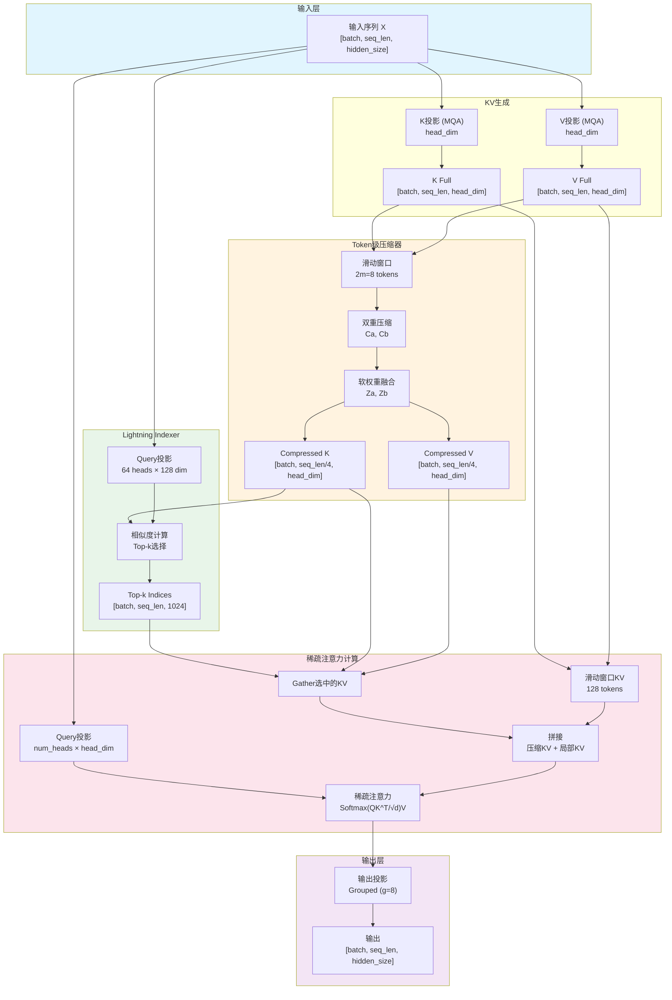
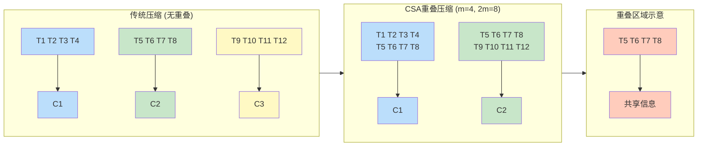
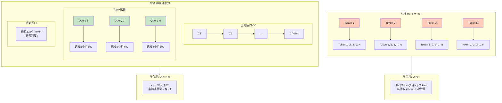
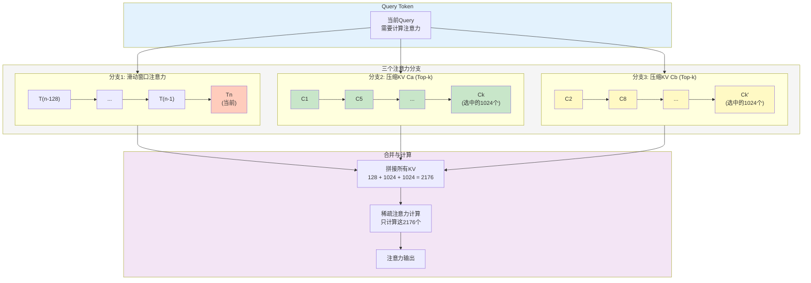
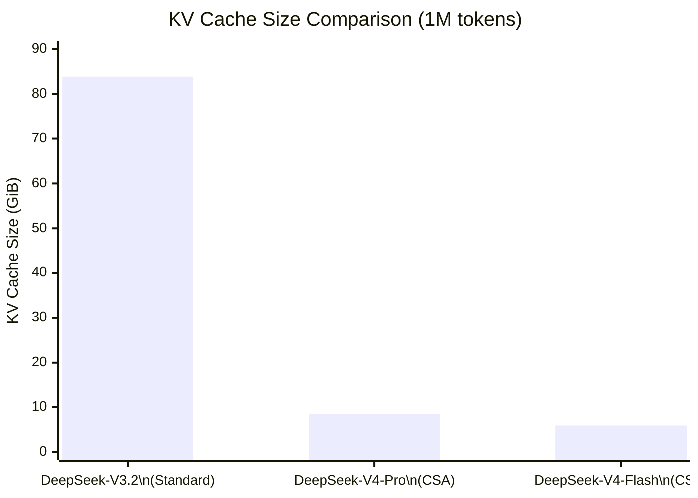
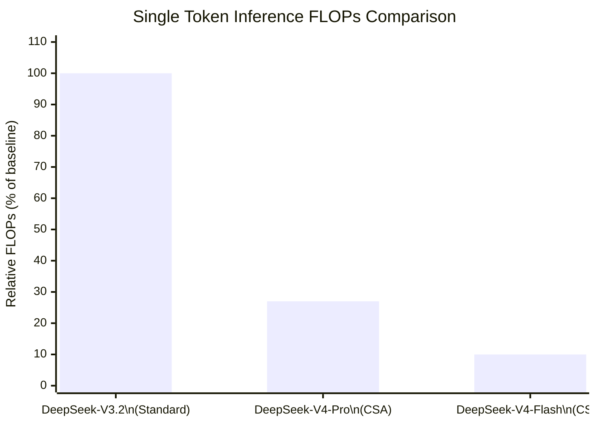

# CSA (Compressed Sparse Attention) 压缩稀疏注意力机制详解

> 本文档基于 DeepSeek-V4 官方技术报告（2025年4月发布）整理
> - 报告标题：DeepSeek-V4: Towards Highly Efficient Million-Token Context Intelligence
> - 报告页数：58页
> - 适用模型：DeepSeek-V4-Pro (1.6T参数) 和 DeepSeek-V4-Flash (284B参数)

---

## 目录

1. [背景与动机](#1-背景与动机)
2. [核心思想](#2-核心思想)
3. [架构组成](#3-架构组成)
   - 3.1 Token级压缩器 (Token-Level Compressor)
   - 3.2 Lightning Indexer
   - 3.3 稀疏注意力机制
   - 3.4 滑动窗口注意力分支
4. [数学原理](#4-数学原理)
5. [配置参数](#5-配置参数)
6. [与HCA的协同工作](#6-与hca的协同工作)
7. [效率分析](#7-效率分析)
8. [实现细节](#8-实现细节)
9. [性能表现](#9-性能表现)
10. [总结与展望](#10-总结与展望)

---

## 1. 背景与动机

### 1.1 长上下文处理的挑战

标准Transformer的自注意力机制具有**二次方计算复杂度**——序列长度翻倍，注意力计算量大致变为四倍。在百万token上下文的场景下，这会带来：

| 上下文长度 | KV Cache大小(近似) | 计算复杂度 |
|-----------|-------------------|-----------|
| 128K tokens | ~11 GiB | O(n²) |
| 256K tokens | ~22 GiB | O(n²) |
| 512K tokens | ~44 GiB | O(n²) |
| 1M tokens | ~88 GiB | O(n²) |

以DeepSeek-V3.2为例，在1M token上下文时，KV Cache需要约**83.9 GiB**内存。单张H200 GPU仅有141 GB显存，KV Cache就占用了超过一半的显存，这使得长上下文推理在实际部署中极为困难。

### 1.2 压缩的必要性

DeepSeek-V4的核心洞察是：**不需要以完整精度记住每一个token**。人类阅读长文档时，会自然地：
- 记住关键段落的核心要点
- 保留近期内容的详细记忆
- 对远距离内容进行高度概括

CSA机制正是模拟了这种"分层记忆"的策略。

---

## 2. 核心思想

CSA（Compressed Sparse Attention，压缩稀疏注意力）的核心思想可以概括为：

> **将KV缓存沿序列维度压缩，然后应用稀疏注意力**

具体包含三个关键步骤：

1. **压缩（Compression）**：将每 `m` 个token的KV条目压缩为1个条目，压缩序列长度至 1/m
2. **索引（Indexing）**：使用Lightning Indexer快速选择最相关的压缩KV条目
3. **稀疏注意力（Sparse Attention）**：每个查询token只关注Top-k个选中的压缩KV条目

```
CSA架构流程：
┌─────────────┐    ┌─────────────────────┐    ┌──────────────────┐
│  Input      │───→│  Token-Level        │───→│  Compressed KV   │
│  Tokens     │    │  Compressor         │    │  Entries         │
└─────────────┘    └─────────────────────┘    └────────┬─────────┘
                                                       │
                                                       ▼
┌─────────────┐    ┌─────────────────────┐    ┌──────────────────┐
│  Output     │←───│  Grouped Output     │←───│  Sparse Attention │
│  Projection │    │  Projection         │    │  (Top-k)         │
└─────────────┘    └─────────────────────┘    └──────────────────┘
                              ▲
                              │
                    ┌─────────┴─────────┐
                    │  Lightning Indexer │
                    │  (Top-k Selection) │
                    └───────────────────┘
```

### 完整数据流图



---

## 3. 架构组成

### 3.1 Token级压缩器 (Token-Level Compressor)

Token级压缩器是CSA的第一道处理流程，负责将连续的token序列压缩成更紧凑的表示。

#### 3.1.1 双重压缩权重

CSA使用**两组KV条目**进行软压缩：
- 压缩KV条目：`Ca` 和 `Cb`
- 压缩权重：`Za` 和 `Zb`

这种双重设计允许模型学习更丰富的压缩表示，而不是简单的平均池化。

#### 3.1.2 重叠压缩策略

与传统的块压缩不同，CSA采用**重叠压缩**：
- 每个压缩条目由 **2m** 个KV条目派生
- 相邻压缩块之间有重叠

```
传统压缩（无重叠）：
Tokens: [T1 T2 T3 T4] [T5 T6 T7 T8] [T9 T10 T11 T12] ...
         ↓              ↓              ↓
Compressed: [C1]       [C2]          [C3]

CSA重叠压缩（m=4）：
Tokens: [T1 T2 T3 T4 T5 T6 T7 T8] [T5 T6 T7 T8 T9 T10 T11 T12] ...
         ↓                        ↓
Compressed: [C1]                  [C2]
              ↑overlap↑
```

### 压缩策略对比图



重叠策略的优势：
- 避免边界效应：token不会在块边界处被割裂
- 平滑过渡：相邻压缩块之间的信息流动更自然
- 更好的局部依赖建模

#### 3.1.3 压缩过程

对于每m个token的KV条目，压缩器执行：

```python
# 伪代码示意
def compress_kv(kv_entries, m, overlap=2):
    """
    kv_entries: [seq_len, head_dim]
    m: 压缩率
    overlap: 重叠因子（默认2，表示每个压缩块覆盖2m个token）
    """
    compressed = []
    stride = m  # 步长为m，保证50%重叠
    
    for i in range(0, len(kv_entries) - overlap*m + 1, stride):
        window = kv_entries[i:i + overlap*m]  # 取2m个token
        # 使用学习到的权重进行压缩
        ca = weighted_compress(window, weight_za)
        cb = weighted_compress(window, weight_zb)
        compressed.append(fuse(ca, cb))
    
    return compressed
```

### 3.2 Lightning Indexer

Lightning Indexer是CSA的核心创新组件，用于高效选择相关的压缩KV条目。

#### 3.2.1 架构设计

```
Lightning Indexer结构：
┌─────────────────────────────────────────────────────────┐
│                    Query Input                         │
└─────────────────────────┬───────────────────────────────┘
                          ▼
┌─────────────────────────────────────────────────────────┐
│              Low-Rank Query Projection                  │
│         (n_h^I heads, c_I dimension per head)          │
└─────────────────────────┬───────────────────────────────┘
                          ▼
┌─────────────────────────────────────────────────────────┐
│              Compressed KV Scoring                      │
│    (计算Query与所有压缩KV条目的相关性分数)              │
└─────────────────────────┬───────────────────────────────┘
                          ▼
┌─────────────────────────────────────────────────────────┐
│              Top-k Selection                            │
│         (选择k个最相关的压缩KV条目)                     │
└─────────────────────────────────────────────────────────┘
```

#### 3.2.2 低秩索引

为了提高效率，Lightning Indexer使用**低秩索引器**：
- **索引器Query头数**：`n_h^I = 64` (V4-Pro)
- **索引器头维度**：`c_I = 128` (V4-Pro)

这种低秩设计大幅降低了计算开销，同时保持了足够的表达能力。

#### 3.2.3 Top-k选择

对于每个查询token，Indexer计算其与所有压缩KV条目的相似度分数，然后选择Top-k个：

```python
# 伪代码示意
def lightning_indexer(query, compressed_kv, k):
    """
    query: [batch, n_h^I, c_I]
    compressed_kv: [num_compressed, head_dim]
    k: 选择的条目数
    """
    # 计算相似度分数
    scores = einsum(query, compressed_kv, 'b h d, n d -> b h n')
    
    # Top-k选择
    top_k_scores, top_k_indices = torch.topk(scores, k, dim=-1)
    
    # 返回选中的压缩KV条目索引
    return top_k_indices, top_k_scores
```

### 3.3 稀疏注意力机制

#### 3.3.1 DeepSeek Sparse Attention (DSA)

CSA采用DeepSeek Sparse Attention（DSA）作为其稀疏注意力实现：

```
标准注意力: Attention(Q, K, V) = softmax(QK^T / √d_k)V
            复杂度: O(n²)

DSA稀疏注意力: 
  1. 只计算Query与Top-k压缩KV的注意力
  2. 忽略其他不相关的KV条目
  复杂度: O(n × k)，其中 k << n/m
```

### 复杂度对比图



#### 3.3.2 共享KV MQA

CSA采用**Multi-Query Attention (MQA)**设计：
- 所有Query头共享同一组压缩后的KV条目
- 压缩后的KV条目同时作为Key和Value使用

这种设计的优势：
- 大幅减少KV Cache内存占用
- 简化注意力计算
- 保持足够的表达能力

### 3.4 滑动窗口注意力分支

为了保留对近期内容的精确记忆，CSA包含一个**滑动窗口注意力分支**：

```
CSA完整注意力流程：
┌────────────────────────────────────────────────────────────┐
│                     Input Query                            │
└──────────────────────┬─────────────────────────────────────┘
                       │
         ┌─────────────┼─────────────┐
         ▼             ▼             ▼
┌─────────────┐ ┌─────────────┐ ┌─────────────┐
│ Sliding     │ │ Compressed  │ │ Compressed  │
│ Window      │ │ KV (Top-k)  │ │ KV (Top-k)  │
│ Attention   │ │    Ca       │ │    Cb       │
│ (local)     │ │  (via Za)   │ │  (via Zb)   │
└──────┬──────┘ └──────┬──────┘ └──────┬──────┘
       │               │               │
       └───────────────┼───────────────┘
                       ▼
              ┌─────────────────┐
              │  Concatenate &  │
              │  Attention      │
              └────────┬────────┘
                       ▼
              ┌─────────────────┐
              │  Grouped Output │
              │  Projection     │
              └─────────────────┘
```

### 三分支注意力流程图



**滑动窗口注意力**：
- 覆盖最近的 `n_win` 个token
- 不进行压缩，保持完整精度
- 用于建模局部依赖关系

---

## 4. 数学原理

### 4.1 压缩过程的形式化描述

设输入序列为 $X \in \mathbb{R}^{n \times d}$，其中 $n$ 是序列长度，$d$ 是隐藏维度。

**标准Transformer的KV计算**：

$$K = X W_K, \quad V = X W_V$$

其中 $K, V \in \mathbb{R}^{n \times d_k}$

**CSA的压缩过程**：

对于第 $i$ 个压缩块（覆盖token从 $i \cdot m$ 到 $(i+2) \cdot m - 1$）：

$$C_i^{(a)} = \text{Compress}^{(a)}(K_{i \cdot m : (i+2) \cdot m}, V_{i \cdot m : (i+2) \cdot m})$$

$$C_i^{(b)} = \text{Compress}^{(b)}(K_{i \cdot m : (i+2) \cdot m}, V_{i \cdot m : (i+2) \cdot m})$$

$$Z_i^{(a)} = \sigma(W_z^{(a)} \cdot \text{Pool}(K_{i \cdot m : (i+2) \cdot m}))$$

$$Z_i^{(b)} = 1 - Z_i^{(a)} \quad \text{(互补权重)}$$

$$C_i = Z_i^{(a)} \odot C_i^{(a)} + Z_i^{(b)} \odot C_i^{(b)}$$

### 4.2 Lightning Indexer的评分函数

设Query投影为 $Q^I \in \mathbb{R}^{n_h^I \times c_I}$，压缩KV为 $C \in \mathbb{R}^{n/m \times d_k}$。

**索引分数计算**：

$$S_{i,j} = \frac{(Q_i^I W_q)(C_j W_c)^T}{\sqrt{c_I}}$$

其中 $W_q, W_c$ 是低秩投影矩阵。

**Top-k选择**：

$$\mathcal{I}_i = \text{TopK}_j(S_{i,j}, k)$$

### 4.3 稀疏注意力计算

对于第 $i$ 个查询token，其注意力输出为：

$$\text{CSA-Attn}(Q_i, K, V) = \text{Softmax}\left(\frac{Q_i [K_{\text{local}}; K_{\mathcal{I}_i}]^T}{\sqrt{d_k}}\right)[V_{\text{local}}; V_{\mathcal{I}_i}]$$

其中：
- $K_{\text{local}}, V_{\text{local}}$ 是滑动窗口内的KV（最近的 $n_{win}$ 个token）
- $K_{\mathcal{I}_i}, V_{\mathcal{I}_i}$ 是通过Lightning Indexer选择的Top-k压缩KV条目
- $[\cdot; \cdot]$ 表示拼接操作

### 4.4 复杂度分析

| 操作 | 时间复杂度 | 空间复杂度 |
|-----|-----------|-----------|
| 标准自注意力 | $O(n^2 \cdot d)$ | $O(n \cdot d)$ |
| CSA压缩 | $O(n \cdot d^2)$ | $O(n/m \cdot d)$ |
| Lightning Indexer | $O(n \cdot n_h^I \cdot c_I \cdot n/m)$ | $O(n/m \cdot d)$ |
| 稀疏注意力 | $O(n \cdot k \cdot d)$ | $O(k \cdot d)$ |
| **CSA总计** | **$O(n \cdot d \cdot (d + k + n_h^I \cdot c_I/m))$** | **$O(n/m \cdot d)$** |

当 $n = 1M$, $m = 4$, $k = 1024$ 时：
- 标准注意力需要处理约 $10^{12}$ 对token关系
- CSA只需要处理约 $10^9$ 对（压缩后）+ $10^6 \times 10^3 = 10^9$（稀疏选择）

### 复杂度曲线图

```mermaid
xychart-beta
    title "Computational Complexity vs Sequence Length"
    x-axis "Sequence Length (tokens)" [128000, 256000, 512000, 1000000]
    y-axis "Relative Computation (log scale)"

    line "Standard Attention O(n²)" [1, 4, 16, 61]
    line "CSA O(n × k)" [1, 2, 4, 8]

    annotation "At 1M tokens:\nStandard: 61x\nCSA: 8x"
```

---

## 5. 配置参数

### 5.1 DeepSeek-V4-Pro CSA配置

| 参数 | 值 | 说明 |
|-----|-----|------|
| 压缩率 $m$ | 4 | 每4个token压缩为1个条目 |
| 压缩块重叠 | 2m = 8 | 每个压缩块覆盖8个token |
| 索引器Query头数 $n_h^I$ | 64 | Lightning Indexer的head数 |
| 索引器头维度 $c_I$ | 128 | 每个索引head的维度 |
| 稀疏注意力Top-k | 1024 | 每个query选择的压缩KV条目数 |
| 滑动窗口大小 $n_{win}$ | 128 | 保留完整精度的局部token数 |
| 分组输出投影数 $g$ | 8 | 输出投影的分组数 |

### 5.2 DeepSeek-V4-Flash CSA配置

| 参数 | 值 | 说明 |
|-----|-----|------|
| 压缩率 $m$ | 4 | 与Pro版本相同 |
| 稀疏注意力Top-k | 512 | 比Pro版本更激进 |
| 其他参数 | 类似 | 针对更小规模优化 |

### 5.3 配置选择 rationale

**为什么是m=4？**
- 平衡压缩率和信息保留
- 4x压缩在大多数情况下能保留足够语义
- 更大的m会导致信息损失增加

**为什么是Top-k=1024？**
- 在1M上下文中，压缩后约有250K个条目
- 选择1024个约占总量的0.4%
- 实验验证这是质量-效率的最佳平衡点

---

## 6. 与HCA的协同工作

CSA通常与HCA（Heavily Compressed Attention，重度压缩注意力）交替使用，形成**混合注意力架构**。

### 6.1 HCA简介

HCA是另一种压缩注意力机制，特点：
- 使用更大的压缩率 $m'$（V4-Pro中 $m' = 128$）
- **不进行稀疏选择**，而是对所有压缩条目做密集注意力
- 捕获全局上下文信息

### 6.2 CSA与HCA的对比

| 特性 | CSA | HCA |
|-----|-----|-----|
| 压缩率 | $m = 4$（较温和） | $m' = 128$（更激进） |
| 注意力类型 | 稀疏注意力（Top-k） | 密集注意力（全连接） |
| 关注范围 | 选择性的重要细节 | 全局概览信息 |
| 类比 | 阅读时的精细阅读 | 阅读时的快速浏览 |
| 适用场景 | 精确定位相关信息 | 理解整体语境 |

### 6.3 层间交替策略

```
V4-Pro的61层Transformer中的注意力配置：

Layer 1-2:   Sliding Window Attention Only
             (建立局部依赖)
Layer 3:     CSA
             (精细注意力)
Layer 4:     HCA  
             (全局概览)
Layer 5:     CSA
Layer 6:     HCA
...
Layer 61:    CSA/HCA (取决于具体设计)
```

这种交替设计实现了：
1. **层次化信息处理**：从局部到全局，再从全局回到局部
2. **计算效率**：CSA和HCA的计算特性互补
3. **质量保证**：避免单一压缩策略的局限

---

## 7. 效率分析

### 7.1 与DeepSeek-V3.2的对比

在1M token上下文的场景下：

| 指标 | DeepSeek-V3.2 | DeepSeek-V4-Pro | DeepSeek-V4-Flash |
|-----|---------------|-----------------|-------------------|
| **单Token推理FLOPs** | 基准 (100%) | **27%** | **10%** |
| **KV Cache大小** | 83.9 GiB | **8.4 GiB (10%)** | **5.9 GiB (7%)** |
| **可部署性** | 需多卡 | 单H200可跑 | 单H200轻松跑 |

### 性能对比图





### 7.2 效率提升来源

CSA的效率提升来自三个方面：

1. **KV Cache压缩 (4x)**：
   - 每4个token压缩为1个条目
   - 直接减少75%的KV Cache占用

2. **稀疏注意力 (~10x)**：
   - 从250K压缩条目中只选1024个
   - 注意力计算量减少约99.6%

3. **共享KV MQA (额外2x)**：
   - 所有Query头共享KV
   - 进一步减少50%内存

**综合效果**：4 × 10 × 2 = **约80倍的理论效率提升**

实际测量为约**10倍KV Cache减少**和**3.7倍FLOPs减少**，这是因为：
- 滑动窗口注意力保持完整计算
- Lightning Indexer有额外开销
- 其他组件（FFN等）不受影响

### 7.3 实际部署成本

**单张H200 (141 GB VRAM) 运行1M上下文**：

```
内存占用估算 (V4-Pro):
├── 模型权重 (FP4+FP8混合):  ~40-50 GiB
├── KV Cache (CSA压缩后):    ~8.4 GiB
├── 激活值和中间缓存:        ~20-30 GiB
├── 系统开销和缓冲区:        ~10-15 GiB
└── 总计:                    ~80-105 GiB ✓ 可运行

对比V3.2:
└── 仅KV Cache就需要:        ~83.9 GiB ✗ 单卡不可行
```

---

## 8. 实现细节

### 8.1 核心伪代码

```python
import torch
import torch.nn as nn
import torch.nn.functional as F

class CSAAttention(nn.Module):
    """
    Compressed Sparse Attention (CSA) 实现
    """
    def __init__(self, config):
        super().__init__()
        self.hidden_size = config.hidden_size
        self.num_heads = config.num_heads
        self.head_dim = config.head_dim
        
        # CSA参数
        self.compression_ratio = config.compression_ratio  # m = 4
        self.overlap_factor = 2  # 重叠因子
        self.top_k = config.top_k  # 1024
        self.window_size = config.window_size  # 128
        
        # Lightning Indexer参数
        self.indexer_heads = config.indexer_heads  # 64
        self.indexer_dim = config.indexer_dim  # 128
        
        # 投影矩阵
        self.q_proj = nn.Linear(self.hidden_size, self.num_heads * self.head_dim)
        self.k_proj = nn.Linear(self.hidden_size, self.head_dim)  # MQA
        self.v_proj = nn.Linear(self.hidden_size, self.head_dim)  # MQA
        self.o_proj = nn.Linear(self.num_heads * self.head_dim, self.hidden_size)
        
        # Token级压缩器
        self.compressor_a = nn.Sequential(
            nn.Linear(self.head_dim * self.compression_ratio * self.overlap_factor, self.head_dim),
            nn.GELU(),
            nn.Linear(self.head_dim, self.head_dim)
        )
        self.compressor_b = nn.Sequential(
            nn.Linear(self.head_dim * self.compression_ratio * self.overlap_factor, self.head_dim),
            nn.GELU(),
            nn.Linear(self.head_dim, self.head_dim)
        )
        
        # 压缩权重生成
        self.z_proj = nn.Linear(
            self.head_dim * self.compression_ratio * self.overlap_factor, 
            1
        )
        
        # Lightning Indexer
        self.indexer_q_proj = nn.Linear(
            self.hidden_size, 
            self.indexer_heads * self.indexer_dim
        )
        self.indexer_kv_proj = nn.Linear(self.head_dim, self.indexer_dim)
        
    def compress_tokens(self, k, v):
        """
        将KV序列压缩为更短的表示
        
        Args:
            k: [batch, seq_len, head_dim]
            v: [batch, seq_len, head_dim]
        
        Returns:
            compressed_k: [batch, compressed_len, head_dim]
            compressed_v: [batch, compressed_len, head_dim]
        """
        batch_size, seq_len, _ = k.shape
        m = self.compression_ratio
        overlap = self.overlap_factor
        window_size = m * overlap  # 8
        stride = m  # 4
        
        compressed_k_list = []
        compressed_v_list = []
        
        # 滑动窗口压缩
        for i in range(0, seq_len - window_size + 1, stride):
            # 提取窗口
            k_window = k[:, i:i+window_size, :]  # [batch, 8, head_dim]
            v_window = v[:, i:i+window_size, :]
            
            # 展平窗口
            k_flat = k_window.reshape(batch_size, -1)  # [batch, 8*head_dim]
            v_flat = v_window.reshape(batch_size, -1)
            
            # 双重压缩
            k_ca = self.compressor_a(k_flat)  # [batch, head_dim]
            k_cb = self.compressor_b(k_flat)
            v_ca = self.compressor_a(v_flat)
            v_cb = self.compressor_b(v_flat)
            
            # 生成软权重
            z_a = torch.sigmoid(self.z_proj(k_flat))  # [batch, 1]
            z_b = 1 - z_a
            
            # 加权融合
            k_compressed = z_a * k_ca + z_b * k_cb
            v_compressed = z_a * v_ca + z_b * v_cb
            
            compressed_k_list.append(k_compressed)
            compressed_v_list.append(v_compressed)
        
        compressed_k = torch.stack(compressed_k_list, dim=1)
        compressed_v = torch.stack(compressed_v_list, dim=1)
        
        return compressed_k, compressed_v
    
    def lightning_index(self, hidden_states, compressed_k):
        """
        Lightning Indexer: 选择Top-k相关的压缩KV条目
        
        Args:
            hidden_states: [batch, seq_len, hidden_size]
            compressed_k: [batch, compressed_len, head_dim]
        
        Returns:
            top_k_indices: [batch, seq_len, top_k]
            top_k_scores: [batch, seq_len, top_k]
        """
        batch_size, seq_len, _ = hidden_states.shape
        compressed_len = compressed_k.shape[1]
        
        # 投影Query用于索引
        q_index = self.indexer_q_proj(hidden_states)  # [batch, seq_len, 64*128]
        q_index = q_index.view(batch_size, seq_len, self.indexer_heads, self.indexer_dim)
        
        # 投影压缩KV
        kv_index = self.indexer_kv_proj(compressed_k)  # [batch, compressed_len, 128]
        
        # 计算相似度分数 [batch, seq_len, heads, compressed_len]
        scores = torch.einsum('bshd,bcd->bshc', q_index, kv_index)
        scores = scores / (self.indexer_dim ** 0.5)
        
        # 跨头平均
        scores = scores.mean(dim=2)  # [batch, seq_len, compressed_len]
        
        # Top-k选择
        top_k_scores, top_k_indices = torch.topk(
            scores, self.top_k, dim=-1, sorted=False
        )
        
        return top_k_indices, top_k_scores
    
    def forward(self, hidden_states, attention_mask=None):
        batch_size, seq_len, _ = hidden_states.shape
        
        # 1. 计算所有token的KV
        k_full = self.k_proj(hidden_states)  # [batch, seq_len, head_dim]
        v_full = self.v_proj(hidden_states)
        
        # 2. 压缩KV
        compressed_k, compressed_v = self.compress_tokens(k_full, v_full)
        # [batch, seq_len/4, head_dim]
        
        # 3. Lightning Indexer选择Top-k
        top_k_indices, _ = self.lightning_index(hidden_states, compressed_k)
        # [batch, seq_len, 1024]
        
        # 4. 收集选中的压缩KV
        # 使用gather收集Top-k压缩KV
        top_k_indices_expanded = top_k_indices.unsqueeze(-1).expand(-1, -1, -1, self.head_dim)
        selected_k = torch.gather(
            compressed_k.unsqueeze(1).expand(-1, seq_len, -1, -1),
            2, top_k_indices_expanded
        )  # [batch, seq_len, top_k, head_dim]
        selected_v = torch.gather(
            compressed_v.unsqueeze(1).expand(-1, seq_len, -1, -1),
            2, top_k_indices_expanded
        )
        
        # 5. 准备局部滑动窗口KV
        if seq_len > self.window_size:
            local_k = k_full[:, -self.window_size:, :]
            local_v = v_full[:, -self.window_size:, :]
        else:
            local_k = k_full
            local_v = v_full
        
        # 6. 拼接局部和压缩KV
        # [batch, seq_len, top_k + window_size, head_dim]
        combined_k = torch.cat([selected_k, local_k.unsqueeze(1).expand(-1, seq_len, -1, -1)], dim=2)
        combined_v = torch.cat([selected_v, local_v.unsqueeze(1).expand(-1, seq_len, -1, -1)], dim=2)
        
        # 7. 计算Query
        q = self.q_proj(hidden_states)
        q = q.view(batch_size, seq_len, self.num_heads, self.head_dim).transpose(1, 2)
        # [batch, num_heads, seq_len, head_dim]
        
        # 8. 扩展KV用于MQA
        combined_k = combined_k.unsqueeze(1)  # [batch, 1, seq_len, combined_len, head_dim]
        combined_v = combined_v.unsqueeze(1)
        
        # 9. 计算注意力
        # 这里需要处理变长注意力，实际实现会使用Flash Attention变体
        attn_output = self.sparse_attention(q, combined_k, combined_v)
        
        # 10. 输出投影
        attn_output = attn_output.transpose(1, 2).contiguous()
        attn_output = attn_output.view(batch_size, seq_len, -1)
        output = self.o_proj(attn_output)
        
        return output
    
    def sparse_attention(self, q, k, v):
        """
        稀疏注意力计算（简化版）
        实际实现会使用优化的kernel
        """
        # q: [batch, num_heads, seq_len, head_dim]
        # k, v: [batch, 1, seq_len, combined_len, head_dim]
        
        scores = torch.einsum('bhqd,bhskd->bhqsk', q, k)
        scores = scores / (self.head_dim ** 0.5)
        
        attn_weights = F.softmax(scores, dim=-1)
        
        output = torch.einsum('bhqsk,bhskd->bhqd', attn_weights, v)
        
        return output
```

### 8.2 FP4量化在CSA中的应用

DeepSeek-V4在CSA的Lightning Indexer QK路径上应用FP4量化：

```python
# 伪代码
class FP4QuantizedLinear(nn.Module):
    """
    FP4量化线性层，用于CSA索引器的QK投影
    """
    def __init__(self, in_features, out_features):
        super().__init__()
        # FP32主权重
        self.weight = nn.Parameter(torch.randn(out_features, in_features))
        
    def forward(self, x):
        # 训练时：模拟FP4量化
        if self.training:
            # FP4量化 -> FP8反量化（无损）
            w_fp4 = quantize_to_fp4(self.weight)  # E2M1格式
            w_fp8 = dequantize_to_fp8(w_fp4)      # E4M3格式
            return F.linear(x, w_fp8)
        else:
            # 推理时：直接使用FP4权重
            w_fp4 = load_fp4_weight(self.weight_fp4_storage)
            return F.linear(x, w_fp4)
```

**FP4量化的关键**：
- FP4 (E2M1) 到 FP8 (E4M3) 的转换是**无损的**
- FP8比FP4多2个指数位，可以精确表示所有FP4值
- 推理时直接使用FP4权重，减少内存带宽

---

## 9. 性能表现

### 9.1 长上下文检索能力

| 基准测试 | DeepSeek-V4-Pro | DeepSeek-V4-Flash | Claude Opus 4.6 | Gemini 3.1 Pro |
|---------|-----------------|-------------------|-----------------|----------------|
| **MRCR 1M (MMR)** | **83.5** | 78.7 | 92.9 | 76.3 |
| **CorpusQA 1M (ACC)** | **62.0** | 58.1 | 71.7 | 53.8 |

**分析**：
- V4-Pro在百万token检索任务上超越了Gemini 3.1 Pro
- 与Claude Opus 4.6仍有差距，但考虑到巨大的效率优势，这是可接受的权衡
- V4-Flash以更小的参数规模实现了接近Pro的性能

### 9.2 压缩对质量的影响

DeepSeek的研究表明，CSA的压缩策略在大多数任务上对质量影响很小：

| 任务类型 | 质量影响 | 说明 |
|---------|---------|------|
| 代码生成 | 无显著影响 | LiveCodeBench 93.5% |
| 数学推理 | 无显著影响 | IMO-AnswerBench 89.8% |
| 日常对话 | 无显著影响 | 非思考模式响应质量高 |
| 长文档检索 | 轻微影响 | 极端needle-in-haystack任务 |
| 精细事实检索 | 轻微影响 | 需要精确定位的任务 |

### 9.3 实际应用场景

CSA机制使以下应用成为可能：

1. **代码库分析**：
   - 处理包含100万token的完整代码仓库
   - 跨文件依赖分析和重构建议

2. **法律文档处理**：
   - 无需分块处理完整的合同或诉讼文档
   - 跨章节条款关联分析

3. **多轮对话**：
   - 维持数小时的对话历史
   - 保持对早期对话内容的记忆

4. **科学研究**：
   - 分析完整的学术论文集
   - 跨论文发现和关联

---

## 10. 总结与展望

### 10.1 CSA的核心贡献

1. **效率革命**：将1M上下文的KV Cache降至10%，使长上下文推理从"理论可行"变为"工程实用"

2. **分层压缩策略**：
   - CSA：温和压缩 + 稀疏选择，保留重要细节
   - HCA：激进压缩 + 密集注意，捕获全局概览
   - 滑动窗口：无压缩，保留精确局部记忆

3. **Lightning Indexer**：高效的低秩索引机制，实现快速的Top-k选择

4. **端到端优化**：从压缩算法到FP4量化，再到融合kernel的完整优化链

### 10.2 局限性与权衡

1. **极端检索任务的精度损失**：
   - needle-in-a-haystack类任务可能遗漏极细粒度的信息
   - 压缩本质上是信息有损的

2. **架构复杂性**：
   - 相比标准注意力，CSA的实现复杂度显著增加
   - 需要精细的超参数调优

3. **训练稳定性**：
   - 压缩器的训练需要特殊技巧
   - Lightning Indexer的收敛需要仔细设计

### 10.3 未来方向

1. **自适应压缩**：
   - 根据内容复杂度动态调整压缩率
   - 重要段落使用更小的m，普通段落使用更大的m

2. **层次化压缩**：
   - 多级压缩金字塔（m=4, 16, 64, 256）
   - 更细粒度的信息分层

3. **学习型压缩**：
   - 使用更强大的神经网络学习压缩表示
   - 可能的压缩目标：保留对下游任务最重要的信息

4. **与其他稀疏注意力结合**：
   - 结合NSA (Native Sparse Attention)
   - 探索更多稀疏模式

### 10.4 对行业的意义

CSA代表了长上下文LLM发展的重要里程碑：

- **技术层面**：证明了百万token上下文可以在消费级硬件上运行
- **产品层面**：使长上下文成为"基础设施"而非"高端功能"
- **研究层面**：为稀疏注意力研究开辟了新的方向

正如DeepSeek技术报告的标题所言：

> **"Towards Highly Efficient Million-Token Context Intelligence"**
> （迈向高效的百万Token上下文智能）

CSA正是实现这一愿景的关键技术之一。

---

## 参考资料

1. **DeepSeek-V4 技术报告**：DeepSeek-V4: Towards Highly Efficient Million-Token Context Intelligence (58 pages, 2025年4月)

2. **开源权重**：
   - HuggingFace: https://huggingface.co/collections/deepseek-ai/deepseek-v4
   - ModelScope: https://modelscope.cn/collections/deepseek-ai/DeepSeek-V4

3. **vLLM实现**：https://docs.sglang.io/cookbook/autoregressive/DeepSeek/DeepSeek-V4

4. **相关论文**：
   - Manifold-Constrained Hyper-Connections (mHC): https://arxiv.org/abs/2512.24880
   - Muon Optimizer: Liu et al., 2025
   - DeepSeek Sparse Attention (DSA): DeepSeek-V3技术报告

---

*文档整理时间：2025年4月*