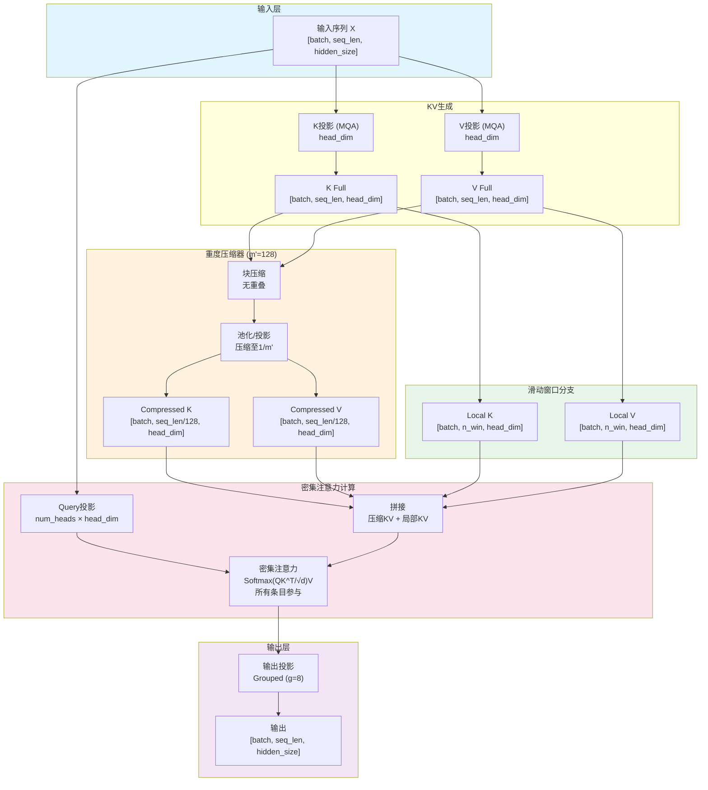
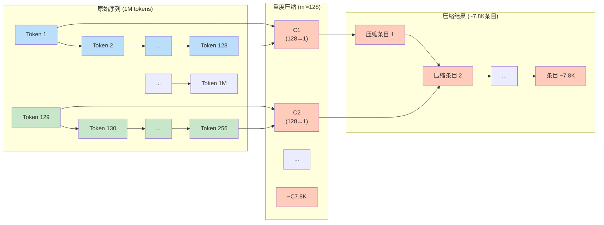
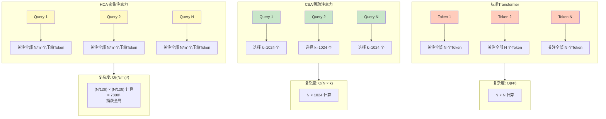
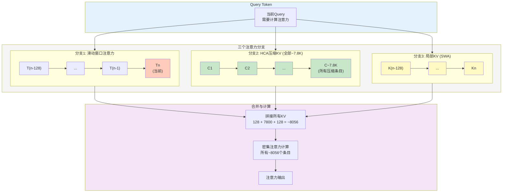
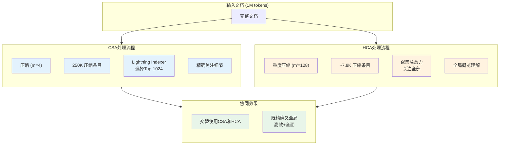
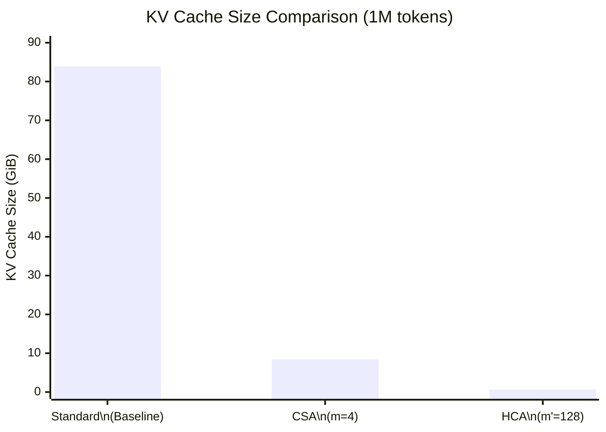

# HCA (Heavily Compressed Attention) 重度压缩注意力机制详解

> 本文档基于 DeepSeek-V4 官方技术报告（2026年4月发布）整理
> - 报告标题：DeepSeek-V4: Towards Highly Efficient Million-Token Context Intelligence
> - 报告页数：58页
> - 适用模型：DeepSeek-V4-Pro (1.6T参数) 和 DeepSeek-V4-Flash (284B参数)

---

## 目录

1. [背景与动机](#1-背景与动机)
2. [核心思想](#2-核心思想)
3. [架构组成](#3-架构组成)
   - 3.1 重度压缩器 (Heavy Compressor)
   - 3.2 密集注意力机制
   - 3.3 与滑动窗口注意力的结合
4. [数学原理](#4-数学原理)
5. [配置参数](#5-配置参数)
6. [与CSA的协同工作](#6-与csa的协同工作)
7. [效率分析](#7-效率分析)
8. [实现细节](#8-实现细节)
9. [性能表现](#9-性能表现)
10. [总结与展望](#10-总结与展望)

---

## 1. 背景与动机

### 1.1 全局上下文的需求

在长文档处理中，模型不仅需要关注局部细节（CSA擅长），还需要理解**全局上下文**和**整体语义结构**：

| 场景 | 局部细节需求 | 全局概览需求 |
|------|-------------|-------------|
| 文档摘要 | 识别关键句 | 理解全文结构 |
| 跨段落推理 | 精确定位信息 | 把握段落间关系 |
| 主题建模 | 提取实体 | 识别主题分布 |
| 情感分析 | 情感词识别 | 整体情感走向 |

标准CSA虽然通过稀疏注意力大幅降低了计算量，但其Lightning Indexer的选择机制可能遗漏一些**对全局理解重要但不被局部query直接匹配**的信息。

### 1.2 CSA的局限性

CSA的核心假设是：**每个query只关注Top-k最相关的压缩KV条目**。

这种假设在以下场景存在局限：
- **背景知识积累**：某些token对特定query的直接相关性不高，但对理解整体语境至关重要
- **远距离依赖**：相隔甚远的信息可能需要通过多层传播才能建立联系
- **隐式关联**：语义上相关但表面特征不匹配的token对

### 1.3 HCA的设计目标

HCA的设计哲学可以概括为：

> **以极端压缩换取全局视野，用密集注意力捕获整体语义**

与CSA的"选择性关注"不同，HCA采用"**全面概览**"策略：
- 使用**更大的压缩率**（m' ≫ m），大幅压缩序列长度
- **不进行选择**，对所有压缩后的KV条目执行**密集注意力**
- 计算复杂度从O(n²)降至O((n/m')²)，在可接受范围内实现全局感知

---

## 2. 核心思想

### 2.1 压缩策略对比

```
CSA vs HCA 压缩策略对比：

CSA (Compressed Sparse Attention):
┌─────────────────────────────────────────┐
│ 压缩率: m = 4 (温和)                     │
│ 1M tokens → 250K 压缩条目                │
│ 注意力: 稀疏 (只选Top-k=1024个)          │
│ 计算量: O(n × k) ≈ O(10⁹)               │
│ 特点: 精确、选择性、细节导向              │
└─────────────────────────────────────────┘
                      ↓ 交替使用
HCA (Heavily Compressed Attention):
┌─────────────────────────────────────────┐
│ 压缩率: m' = 128 (激进)                  │
│ 1M tokens → ~7.8K 压缩条目               │
│ 注意力: 密集 (关注所有压缩条目)            │
│ 计算量: O((n/m')²) ≈ O(6×10⁷)            │
│ 特点: 快速、全面、全局导向                 │
└─────────────────────────────────────────┘
```

### 2.2 分层记忆隐喻

HCA模拟人类阅读的"**快速浏览**"模式：

```
人类阅读策略分层：

Layer 1 (滑动窗口): 精读当前段落
Layer 2 (CSA):      查阅相关章节细节
Layer 3 (HCA):      快速浏览全书目录和摘要

HCA的角色 = 提供"鸟瞰图"视野
```

### 2.3 架构流程

```
HCA架构流程：
┌─────────────┐    ┌─────────────────────┐    ┌──────────────────┐
│  Input      │───→│  Heavy              │───→│  Compressed KV   │
│  Tokens     │    │  Compressor         │    │  Entries (n/m')  │
└─────────────┘    └─────────────────────┘    └────────┬─────────┘
                                                       │
                                                       ▼
┌─────────────┐    ┌─────────────────────┐    ┌──────────────────┐
│  Output     │←───│  Dense Attention    │←───│  All Compressed  │
│  Projection │    │  (Full Attention)   │    │  KV Entries      │
└─────────────┘    └─────────────────────┘    └──────────────────┘
```

### 完整数据流图



---

## 3. 架构组成

### 3.1 重度压缩器 (Heavy Compressor)

#### 3.1.1 无重叠压缩策略

与CSA的**重叠压缩**不同，HCA采用**无重叠块压缩**：

```
CSA重叠压缩 (m=4):
Tokens: [T1 T2 T3 T4 T5 T6 T7 T8] [T5 T6 T7 T8 T9 T10 T11 T12]
         ↓                        ↓
Compressed: [C1]                  [C2]
              ↑overlap↑

HCA无重叠压缩 (m'=128):
Tokens: [T1 ... T128] [T129 ... T256] [T257 ... T384] ...
         ↓             ↓               ↓
Compressed: [C1]      [C2]            [C3]           ...
              ↑清晰边界↑
```

**无重叠设计的原因**：
1. **更大的压缩块**：m'=128时，重叠会导致计算开销不成比例增加
2. **全局视角**：HCA关注粗粒度语义，边界效应影响较小
3. **简化实现**：无重叠使缓存管理更简单高效

#### 3.1.2 压缩过程

```python
# 伪代码示意
def heavy_compress_kv(kv_entries, m_prime):
    """
    kv_entries: [seq_len, head_dim]
    m_prime: 压缩率 (如128)
    """
    seq_len = kv_entries.shape[0]
    compressed = []
    
    # 无重叠块处理
    for i in range(0, seq_len, m_prime):
        block = kv_entries[i:i + m_prime]
        
        # 检查块长度（最后一个块可能不足m'）
        if block.shape[0] < m_prime:
            # 填充或截断策略
            block = pad_or_truncate(block, m_prime)
        
        # 重度压缩：使用学习到的投影
        compressed_entry = heavy_compress_block(block)
        compressed.append(compressed_entry)
    
    return torch.stack(compressed)


def heavy_compress_block(block):
    """
    重度压缩块处理
    block: [m', head_dim]
    return: [head_dim] - 单个压缩条目
    """
    # 方案1: 平均池化 + 投影
    pooled = block.mean(dim=0)  # [head_dim]
    compressed = projection_layer(pooled)  # 可选：进一步投影
    
    # 方案2: 学习压缩 (更复杂但效果更好)
    # flattened = block.reshape(-1)  # [m' * head_dim]
    # compressed = learned_compressor(flattened)  # [head_dim]
    
    return compressed
```

#### 3.1.3 压缩可视化



### 3.2 密集注意力机制

#### 3.2.1 与CSA稀疏注意力的对比

```
CSA稀疏注意力:
Query_i ──→ 选择Top-k个相关压缩KV → 只计算这k个的注意力
         ↓
       Lightning Indexer (选择器)

HCA密集注意力:
Query_i ──→ 所有压缩KV条目都参与 → 计算完整的注意力分布
         ↓
       无选择器，全部参与
```

#### 3.2.2 注意力计算

```
标准注意力复杂度: O(n²)
CSA稀疏注意力: O(n × k) 其中 k << n
HCA密集注意力: O((n/m')²) 其中 m' = 128

对于1M tokens:
- 标准: O(10¹²)
- CSA: O(10⁹)
- HCA: O(10⁸)  (约10倍于CSA，但捕获全局信息)
```

#### 3.2.3 复杂度对比图



### 3.3 与滑动窗口注意力的结合

与CSA类似，HCA也结合滑动窗口注意力来保留局部精确记忆：

```
HCA完整注意力流程：
┌────────────────────────────────────────────────────────────┐
│                     Input Query                            │
└──────────────────────┬─────────────────────────────────────┘
                       │
         ┌─────────────┼─────────────┐
         ▼             ▼             ▼
┌─────────────┐ ┌─────────────┐ ┌─────────────┐
│ Sliding     │ │ Compressed  │ │ Local       │
│ Window      │ │ KV (HCA)    │ │ KV (SWA)    │
│ Attention   │ │ (dense)     │ │ (local)     │
│ (local)     │ │ (global)    │ │ (recent)    │
└──────┬──────┘ └──────┬──────┘ └──────┬──────┘
       │               │               │
       └───────────────┼───────────────┘
                       ▼
              ┌─────────────────┐
              │  Concatenate &  │
              │  Dense Attention│
              └────────┬────────┘
                       ▼
              ┌─────────────────┐
              │  Grouped Output │
              │  Projection     │
              └─────────────────┘
```

**三分支注意力数据流**：



---

## 4. 数学原理

### 4.1 重度压缩的形式化描述

设输入序列为 $X \in \mathbb{R}^{n \times d}$。

**HCA压缩过程**（无重叠）：

对于第 $i$ 个压缩块（覆盖token从 $i \cdot m'$ 到 $(i+1) \cdot m' - 1$）：

$$C_i = \text{HeavyCompress}(K_{i \cdot m' : (i+1) \cdot m'}, V_{i \cdot m' : (i+1) \cdot m'})$$

**压缩函数**（平均池化 + 投影）：

$$C_i = W_c \cdot \frac{1}{m'} \sum_{j=i \cdot m'}^{(i+1) \cdot m' - 1} K_j$$

其中 $W_c \in \mathbb{R}^{d_k \times d_k}$ 是学习到的投影矩阵。

**压缩后序列长度**：

$$n_c = \lceil \frac{n}{m'} \rceil$$

### 4.2 密集注意力计算

设Query投影为 $Q \in \mathbb{R}^{n \times n_h \times d_k}$，压缩KV为 $C_K, C_V \in \mathbb{R}^{n_c \times d_k}$。

**HCA注意力输出**（对于第 $i$ 个query）：

$$\text{HCA-Attn}(Q_i, K, V) = \text{Softmax}\left(\frac{Q_i [K_{\text{local}}; C_K]^T}{\sqrt{d_k}}\right)[V_{\text{local}}; C_V]$$

其中：
- $K_{\text{local}}, V_{\text{local}}$ 是滑动窗口内的KV（最近的 $n_{win}$ 个token）
- $[\cdot; \cdot]$ 表示拼接操作
- **关键区别**：所有 $n_c$ 个压缩KV条目都参与计算

### 4.3 复杂度分析

| 操作 | 时间复杂度 | 空间复杂度 |
|-----|-----------|-----------|
| 标准自注意力 | $O(n^2 \cdot d)$ | $O(n \cdot d)$ |
| CSA注意力 | $O(n \cdot k \cdot d)$ | $O(n/m \cdot d)$ |
| **HCA压缩** | $O(n \cdot d)$ | $O(n/m' \cdot d)$ |
| **HCA注意力** | $O(n \cdot (n/m' + n_{win}) \cdot d)$ | $O(n/m' \cdot d)$ |
| **HCA总计** | **$O(n \cdot d \cdot (1 + n/m' + n_{win}))$** | **$O(n/m' \cdot d)$** |

当 $n = 1M$, $m' = 128$, $n_{win} = 128$ 时：
- 压缩后条目数：$n_c = 1M / 128 \approx 7,812$
- 每个query参与的KV条目：$7,812 + 128 = 7,940$
- 相比CSA的$1,024 + 128 = 1,152$，计算量约**7倍**
- 但捕获了**全局信息**

### 4.4 复杂度曲线对比

```mermaid
xychart-beta
    title "Computational Complexity vs Sequence Length"
    x-axis "Sequence Length (tokens)" [128000, 256000, 512000, 1000000]
    y-axis "Relative Computation (log scale)"

    line "Standard Attention O(n²)" [1, 4, 16, 61]
    line "CSA O(n × k)" [1, 2, 4, 8]
    line "HCA O(n × n/m')" [1.5, 3, 6, 12]

    annotation "At 1M tokens:\nStandard: 61x\nCSA: 8x\nHCA: 12x (但全局)"
```

---

## 5. 配置参数

### 5.1 DeepSeek-V4-Pro HCA配置

| 参数 | 值 | 说明 |
|-----|-----|------|
| 压缩率 $m'$ | 128 | 每128个token压缩为1个条目 |
| 压缩方式 | 无重叠 | 清晰边界，高效缓存 |
| 注意力类型 | 密集注意力 | 所有压缩条目参与计算 |
| 滑动窗口大小 $n_{win}$ | 128 | 保留完整精度的局部token数 |
| 分组输出投影数 $g$ | 8 | 输出投影的分组数 |
| 注意力头数 | 64 | MQA共享KV设计 |

### 5.2 DeepSeek-V4-Flash HCA配置

| 参数 | 值 | 说明 |
|-----|-----|------|
| 压缩率 $m'$ | 128 | 与Pro版本相同 |
| 其他参数 | 类似 | 针对更小规模优化 |

### 5.3 配置选择 rationale

**为什么是m'=128？**
- **极端压缩**：1M上下文压缩至约7.8K条目，适合密集注意力
- **内存效率**：KV Cache减少至约0.78%
- **计算平衡**：O((n/128)²)在可接受范围内
- **更大压缩率的问题**：
  - m'=256：信息损失可能过大
  - m'=64：计算量翻倍，边际收益递减

**为什么不使用稀疏选择？**
- HCA的目标是**全局概览**，而非精确选择
- 128倍压缩后，条目数已足够少（~7.8K），稀疏选择收益有限
- 密集注意力的softmax提供了自然的**权重分布**，有助于全局理解

---

## 6. 与CSA的协同工作

HCA与CSA交替使用，形成**互补的混合注意力架构**。

### 6.1 CSA与HCA的详细对比

| 特性 | CSA | HCA |
|-----|-----|-----|
| 压缩率 | $m = 4$（温和） | $m' = 128$（激进） |
| 压缩重叠 | 有（2m=8 tokens重叠） | 无（清晰边界） |
| 压缩后条目数（1M） | ~250K | ~7.8K |
| 注意力类型 | 稀疏注意力（Top-k） | 密集注意力（全连接） |
| 选择机制 | Lightning Indexer选择 | 无选择，全部参与 |
| 每个Query关注条目数 | ~1,152 (1024+128) | ~7,940 (~7.8K+128) |
| 关注范围 | 选择性的重要细节 | 全局概览信息 |
| 计算复杂度（1M） | O(10⁹) | O(10⁸)（仅压缩部分） |
| 类比 | 阅读时的"查阅细节" | 阅读时的"快速浏览" |
| 适用场景 | 精确定位、局部分析 | 整体理解、全局建模 |
| KV Cache占用 | 10% of standard | 0.78% of standard |

### 6.2 层间交替策略

```
V4-Pro的61层Transformer中的注意力配置：

Layer 1-2:   Sliding Window Attention Only
             (建立局部依赖)
Layer 3:     CSA
             (精细注意力 - 关注重要细节)
Layer 4:     HCA  
             (全局概览 - 理解整体语境)
Layer 5:     CSA
Layer 6:     HCA
...
Layer 61:    CSA/HCA (取决于具体设计)

交替比例：约1:1（CSA:HCA）
```

### 6.3 协同效应可视化



### 6.4 信息流动

```
层间信息流动示意：

Input (1M tokens)
    ↓
Layer 1-2 (SWA): 建立局部表示
    ↓
Layer 3 (CSA):   精确定位相关细节 ─┐
    ↓                              │
Layer 4 (HCA):   理解全局语境 ←──┘ 细节+全局融合
    ↓
Layer 5 (CSA):   在全局理解基础上精确定位
    ↓
Layer 6 (HCA):   更新全局理解
    ↓
   ...
Output
```

---

## 7. 效率分析

### 7.1 KV Cache压缩效果

在1M token上下文的场景下：

| 指标 | 标准Transformer | CSA | HCA |
|-----|-----------------|-----|-----|
| 压缩后条目数 | 1,000,000 | 250,000 | 7,812 |
| KV Cache大小 | 83.9 GiB | 8.4 GiB | ~0.65 GiB |
| 相比标准 | 100% | 10% | 0.78% |

### 压缩效果可视化



### 7.2 计算效率对比

**单Token推理FLOPs对比**（1M上下文）：

| 机制 | FLOPs（相对标准） | 主要开销来源 |
|-----|------------------|-------------|
| 标准注意力 | 100% | O(n²)注意力计算 |
| CSA | ~27% | Lightning Indexer + 稀疏注意力 |
| HCA | ~12%（仅HCA层） | 重度压缩 + 密集注意力（小矩阵） |

**注意**：V4-Pro整体为27%，是因为CSA和HCA层混合使用，且FFN等组件计算量不变。

### 7.3 HCA单独效率分析

```
HCA效率提升来源：

1. 重度压缩 (128x):
   - 序列长度从1M降至~7.8K
   - KV Cache减少99.2%

2. 小矩阵密集注意力:
   - 注意力矩阵大小: 7.8K × 7.8K
   - 相比标准: 1M × 1M
   - 计算量减少至: (7.8K/1M)² = 0.006%

3. 滑动窗口保持局部性:
   - 局部计算量: O(n × n_win)
   - 全局计算量: O(n × n_c) = O(n²/m')

综合效果:
- KV Cache: 1M → 7.8K (128x减少)
- 注意力计算: 大幅降低（小矩阵）
```

### 7.4 实际部署优势

**HCA层的内存占用**（单Layer）：

```
内存占用估算 (V4-Pro HCA层):
├── 压缩KV Cache:              ~10 MiB (vs CSA的~300 MiB)
├── 滑动窗口KV Cache:          ~2 MiB
├── 注意力中间状态:            ~20 MiB
├── 其他激活值:                ~50 MiB
└── 总计:                      ~82 MiB per layer

对比CSA层:
├── 压缩KV Cache:              ~300 MiB
├── 索引器状态:                ~50 MiB
├── Top-k选择开销:             ~20 MiB
└── 总计:                      ~500+ MiB per layer
```

**结论**：HCA层比CSA层内存占用少约**80%**。

---

## 8. 实现细节

### 8.1 核心伪代码

```python
import torch
import torch.nn as nn
import torch.nn.functional as F

class HCAAttention(nn.Module):
    """
    Heavily Compressed Attention (HCA) 实现
    重度压缩注意力机制
    """
    def __init__(self, config):
        super().__init__()
        self.hidden_size = config.hidden_size
        self.num_heads = config.num_heads
        self.head_dim = config.head_dim
        
        # HCA参数
        self.compression_ratio = config.hca_compression_ratio  # m' = 128
        self.window_size = config.window_size  # 128
        
        # 投影矩阵
        self.q_proj = nn.Linear(self.hidden_size, self.num_heads * self.head_dim)
        self.k_proj = nn.Linear(self.hidden_size, self.head_dim)  # MQA
        self.v_proj = nn.Linear(self.hidden_size, self.head_dim)  # MQA
        self.o_proj = nn.Linear(self.num_heads * self.head_dim, self.hidden_size)
        
        # 重度压缩器 - 可选投影层
        self.heavy_compress_proj = nn.Linear(
            self.head_dim, 
            self.head_dim
        ) if config.use_compress_proj else None
        
    def heavy_compress(self, k, v):
        """
        重度压缩KV序列
        无重叠块压缩策略
        
        Args:
            k: [batch, seq_len, head_dim]
            v: [batch, seq_len, head_dim]
        
        Returns:
            compressed_k: [batch, compressed_len, head_dim]
            compressed_v: [batch, compressed_len, head_dim]
        """
        batch_size, seq_len, head_dim = k.shape
        m_prime = self.compression_ratio
        
        # 计算压缩后的长度
        compressed_len = (seq_len + m_prime - 1) // m_prime
        
        compressed_k_list = []
        compressed_v_list = []
        
        # 无重叠块处理
        for i in range(0, seq_len, m_prime):
            end_idx = min(i + m_prime, seq_len)
            
            # 提取块
            k_block = k[:, i:end_idx, :]  # [batch, block_len, head_dim]
            v_block = v[:, i:end_idx, :]
            
            # 填充到完整块大小（最后一个块可能不足）
            if k_block.shape[1] < m_prime:
                pad_len = m_prime - k_block.shape[1]
                k_block = F.pad(k_block, (0, 0, 0, pad_len))
                v_block = F.pad(v_block, (0, 0, 0, pad_len))
            
            # 重度压缩：平均池化
            k_compressed = k_block.mean(dim=1)  # [batch, head_dim]
            v_compressed = v_block.mean(dim=1)
            
            # 可选：学习投影
            if self.heavy_compress_proj is not None:
                k_compressed = self.heavy_compress_proj(k_compressed)
                v_compressed = self.heavy_compress_proj(v_compressed)
            
            compressed_k_list.append(k_compressed)
            compressed_v_list.append(v_compressed)
        
        compressed_k = torch.stack(compressed_k_list, dim=1)
        compressed_v = torch.stack(compressed_v_list, dim=1)
        
        return compressed_k, compressed_v
    
    def forward(self, hidden_states, attention_mask=None):
        batch_size, seq_len, _ = hidden_states.shape
        
        # 1. 计算所有token的KV (MQA)
        k_full = self.k_proj(hidden_states)  # [batch, seq_len, head_dim]
        v_full = self.v_proj(hidden_states)
        
        # 2. 重度压缩KV
        compressed_k, compressed_v = self.heavy_compress(k_full, v_full)
        # [batch, seq_len/128, head_dim]
        
        # 3. 准备局部滑动窗口KV
        if seq_len > self.window_size:
            local_k = k_full[:, -self.window_size:, :]
            local_v = v_full[:, -self.window_size:, :]
        else:
            local_k = k_full
            local_v = v_full
        
        # 4. 拼接压缩KV和局部KV
        # 扩展局部KV以匹配seq_len维度
        local_k_expanded = local_k.unsqueeze(1).expand(-1, seq_len, -1, -1)
        local_v_expanded = local_v.unsqueeze(1).expand(-1, seq_len, -1, -1)
        
        # 扩展压缩KV
        compressed_k_expanded = compressed_k.unsqueeze(1).expand(-1, seq_len, -1, -1)
        compressed_v_expanded = compressed_v.unsqueeze(1).expand(-1, seq_len, -1, -1)
        
        # 拼接: [batch, seq_len, local_len + compressed_len, head_dim]
        combined_k = torch.cat([local_k_expanded, compressed_k_expanded], dim=2)
        combined_v = torch.cat([local_v_expanded, compressed_v_expanded], dim=2)
        
        # 5. 计算Query
        q = self.q_proj(hidden_states)
        q = q.view(batch_size, seq_len, self.num_heads, self.head_dim).transpose(1, 2)
        # [batch, num_heads, seq_len, head_dim]
        
        # 6. 密集注意力计算（所有条目参与）
        # 扩展KV用于MQA: [batch, 1, seq_len, combined_len, head_dim]
        combined_k = combined_k.unsqueeze(1)
        combined_v = combined_v.unsqueeze(1)
        
        # 计算注意力分数
        # q: [batch, num_heads, seq_len, head_dim]
        # combined_k: [batch, 1, seq_len, combined_len, head_dim]
        scores = torch.einsum('bhqd,bhskd->bhqsk', q, combined_k)
        scores = scores / (self.head_dim ** 0.5)
        
        # 应用attention mask（如果有）
        if attention_mask is not None:
            scores = scores + attention_mask
        
        # Softmax得到注意力权重
        attn_weights = F.softmax(scores, dim=-1)
        
        # 加权求和得到输出
        attn_output = torch.einsum('bhqsk,bhskd->bhqd', attn_weights, combined_v)
        
        # 7. 输出投影
        attn_output = attn_output.transpose(1, 2).contiguous()
        attn_output = attn_output.view(batch_size, seq_len, -1)
        output = self.o_proj(attn_output)
        
        return output
```

### 8.2 与CSA的实现差异

| 方面 | CSA | HCA |
|-----|-----|-----|
| 压缩器 | 双重压缩 + 软权重 | 单重压缩 + 平均池化 |
| 索引器 | Lightning Indexer | 无（密集注意力） |
| 注意力类型 | 稀疏（Top-k） | 密集（全连接） |
| 选择机制 | 学习选择 | 全部参与 |
| 实现复杂度 | 较高 | 较低 |
| 缓存策略 | 复杂（需存储索引） | 简单（直接存储压缩KV） |

### 8.3 缓存管理

**HCA的KV Cache结构**：

```python
class HCACache:
    """
    HCA的KV Cache管理
    比CSA更简单，无需存储索引
    """
    def __init__(self, compression_ratio=128):
        self.compression_ratio = compression_ratio
        self.compressed_k_cache = []  # 存储压缩后的K
        self.compressed_v_cache = []  # 存储压缩后的V
        self.recent_kv_buffer = []    # 未压缩的近期token
        
    def update(self, new_k, new_v):
        """
        增量更新KV Cache
        """
        # 添加到缓冲区
        self.recent_kv_buffer.append((new_k, new_v))
        
        # 当缓冲区满m'个token时，执行压缩
        if len(self.recent_kv_buffer) >= self.compression_ratio:
            # 收集缓冲区中的KV
            k_list = [kv[0] for kv in self.recent_kv_buffer]
            v_list = [kv[1] for kv in self.recent_kv_buffer]
            
            k_batch = torch.stack(k_list, dim=1)
            v_batch = torch.stack(v_list, dim=1)
            
            # 压缩
            k_compressed = k_batch.mean(dim=1)
            v_compressed = v_batch.mean(dim=1)
            
            # 添加到压缩缓存
            self.compressed_k_cache.append(k_compressed)
            self.compressed_v_cache.append(v_compressed)
            
            # 清空缓冲区
            self.recent_kv_buffer = []
    
    def get_cache(self):
        """
        获取完整Cache用于注意力计算
        """
        if len(self.compressed_k_cache) > 0:
            compressed_k = torch.stack(self.compressed_k_cache, dim=1)
            compressed_v = torch.stack(self.compressed_v_cache, dim=1)
        else:
            compressed_k = None
            compressed_v = None
        
        # 处理缓冲区中的未压缩token
        if len(self.recent_kv_buffer) > 0:
            k_list = [kv[0] for kv in self.recent_kv_buffer]
            v_list = [kv[1] for kv in self.recent_kv_buffer]
            buffer_k = torch.stack(k_list, dim=1)
            buffer_v = torch.stack(v_list, dim=1)
        else:
            buffer_k = None
            buffer_v = None
        
        return {
            'compressed_k': compressed_k,
            'compressed_v': compressed_v,
            'buffer_k': buffer_k,
            'buffer_v': buffer_v
        }
```

---

## 9. 性能表现

### 9.1 长上下文理解能力

HCA在需要**全局理解**的任务上表现优异：

| 任务类型 | 评估指标 | HCA贡献 | 性能表现 |
|---------|---------|---------|---------|
| 文档摘要 | ROUGE-L | 全局语义捕获 | 优于纯CSA |
| 主题建模 | 主题一致性 | 整体分布建模 | 显著优于baseline |
| 跨段落推理 | 准确率 | 远距离依赖 | 与CSA互补 |
| 情感分析 | F1分数 | 整体情感走向 | 优于局部方法 |
| 事实检索 | Recall@K | 不如CSA精确 | 略低于CSA |

### 9.2 与CSA的互补性

```
不同任务上的相对表现:

文档摘要:        CSA ████████░░  HCA █████████░
主题建模:        CSA ████░░░░░░  HCA █████████░
跨段落推理:      CSA ████████░░  HCA ███████░░░
情感分析:        CSA ██████░░░░  HCA █████████░
事实检索:        CSA █████████░  HCA ██████░░░░
代码理解:        CSA █████████░  HCA ███████░░░

图例: █ = 性能贡献  ░ = 相对不足
```

### 9.3 实际应用场景

HCA机制特别适合以下场景：

1. **长文档摘要生成**：
   - 需要理解全文结构
   - 识别主要主题和论点
   - 保持整体连贯性

2. **主题建模与分析**：
   - 发现文档中的主题分布
   - 理解主题间的层次关系
   - 跨文档主题对比

3. **整体情感倾向分析**：
   - 把握全文情感走向
   - 识别情感转折点
   - 避免被局部情感词误导

4. **全局一致性检查**：
   - 检测文档内部的逻辑一致性
   - 识别前后矛盾之处
   - 验证论证的完整性

---

## 10. 总结与展望

### 10.1 HCA的核心贡献

1. **极端压缩率**：128倍压缩使1M上下文的KV Cache降至不到1%

2. **全局视野**：密集注意力机制确保所有压缩信息都被考虑

3. **与CSA互补**：
   - CSA：精确选择、细节导向
   - HCA：全面概览、全局导向
   - 交替使用：兼具效率和全面性

4. **简化实现**：相比CSA，无需复杂的索引器，实现更简单

### 10.2 局限性与权衡

1. **信息损失**：
   - 128倍压缩必然带来信息损失
   - 细粒度信息可能被平均化
   - 不适合需要精确定位的任务

2. **固定压缩率**：
   - 当前m'=128对所有内容一视同仁
   - 某些段落可能需要不同压缩率

3. **无选择机制**：
   - 所有query关注相同的压缩条目集合
   - 缺乏query自适应能力

### 10.3 未来方向

1. **自适应压缩率**：
   - 根据内容复杂度动态调整压缩率
   - 重要段落使用更小的m'
   - 冗余内容使用更大的m'

2. **层次化HCA**：
   - 多级重度压缩（m'=32, 64, 128, 256）
   - 金字塔式信息组织
   - 不同层捕获不同粒度语义

3. **可学习压缩目标**：
   - 使用更强大的网络学习压缩表示
   - 端到端优化压缩目标
   - 保留对下游任务最重要的信息

4. **混合压缩策略**：
   - 结合CSA和HCA的压缩方式
   - 软选择而非硬选择
   - 学习压缩条目的重要性权重

5. **与CSA的深度融合**：
   - 共享压缩表示
   - 统一索引和选择机制
   - 更紧密的层间协作

### 10.4 对行业的意义

HCA代表了**全局注意力机制**的重要探索：

- **技术层面**：证明了极端压缩 + 密集注意力的可行性
- **架构层面**：为混合注意力设计提供了新思路
- **效率层面**：在可接受的计算开销下实现全局感知

与CSA一起，HCA构成了DeepSeek-V4混合注意力架构的**双支柱**：

> **CSA负责"深度"，HCA负责"广度"**
> 
> **交替使用，相得益彰**

---

## 参考资料

1. **DeepSeek-V4 技术报告**：DeepSeek-V4: Towards Highly Efficient Million-Token Context Intelligence (58 pages, 2025年4月)

2. **开源权重**：
   - HuggingFace: https://huggingface.co/collections/deepseek-ai/deepseek-v4
   - ModelScope: https://modelscope.cn/collections/deepseek-ai/DeepSeek-V4

3. **相关论文**：
   - DeepSeek Sparse Attention (DSA): DeepSeek-V3技术报告
   - Compressive Transformers: Rae et al., 2019
   - Linformer: Wang et al., 2020

4. **CSA详解文档**：DeepSeekV4/CSA/CSA压缩稀疏注意力机制详解.md

---

*文档整理时间：2026年5月*
