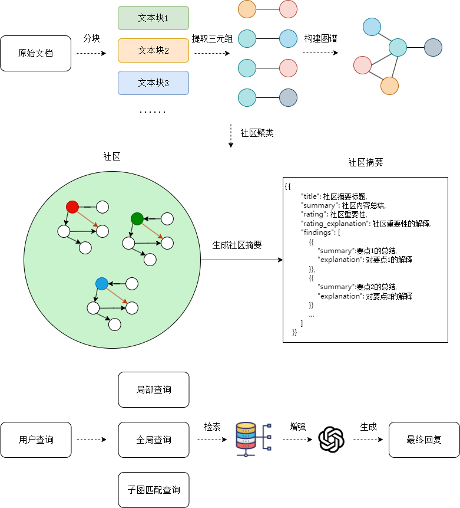
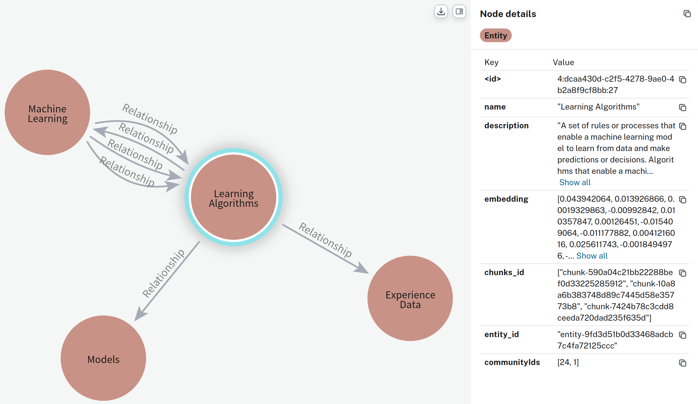
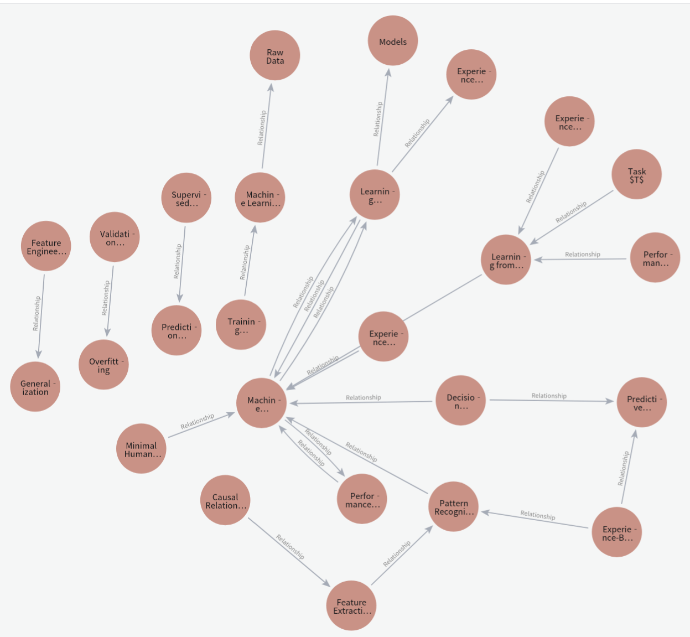

# GraphRAG

> 本文档参考了[DataWhale](https://github.com/datawhalechina/tiny-universe/tree/main/content/TinyGraphRAG)，感谢！

## 项目动机

RAG技术在分块策略上存在一些问题，例如：

```
chunk 1
小明的爷爷叫老明

chunk 2
小明的爷爷是一个木匠

chunk 3
小明的爷爷...
```

假如我们希望查询的信息是：“小明认识的木匠叫什么名字？”，很明显这段话需要召回两个chunk来回答。显而易见，chunk2的相关性更强，但是仅仅召回chunk2并不能回答这个问题。而真正关键的chunk1片段可能无法碑召回，原因在于，**分块策略实际上破坏了文档的语义连续性。**有些工作，比如**late chunking策略**和**GraphRAG**都是一些解决这个问题的方案。

同时，RAG技术还面临一个比较棘手的问题，即全局信息的查询。假如我们有一个文档，我们希望查询“文档中小明所有家人的信息”，这同样是一个重大挑战。因为这些信息可能存在不同的位置，按照分块检索的难度很大。同时，还有可能涉及一些复杂的推理问题，同样也有一些工作提出了Agentic RAG策略来尝试解决，GraphRAG也提供了自己的解决方案，即通过图中的社区聚类，预先聚类信息用以应对用户的提问。

**值得注意的是，去阅读和复现源码仍然十分的重要！**

## 前置实现

### 1. 实现LLM模块

首先我们需要实现LLM模块，这是系统中最基本的模块，我们将利用大模型完成文档的清洗、信息提取等工作，可以说GraphRAG的一部分精髓就是使用大模型预先处理文档信息，方便后续检索。

```python
from abc import ABC, abstractmethod
from typing import Any, Optional

class BaseLLM(ABC):
    '''Interface for large language models.
    
    Args: 
    	model_name(str): The name of LLM.
    	model_params(Optional[dict[str, Any]], optional): Additional parameters passed to the model when text is sent to it. Defaults to None.
    	**kwargs(Any): Arguments passed to the model when for the class is initialised. Defualts to None.
    '''
    def __init__(
        self, 
        model_name:str, 
        model_params: Optional[dict[str, Any]] = None, 
        **kwargs: Any
    ):
        self.model_name = model_name
        self.model_params = model_params
        
    @abstractmethod
    def predict(self, input: str) -> str:
        '''Sends a text input to the LLM and retrieves a response.
        
        Args:
        	input(str): Text sent to the LLM.
        	
        Returns:
        	str: The response from the LLM.
        '''
        pass
```

如上是一个调用大模型的抽象接口，这可以帮助我们统一大模型的调用形式，继承这个类，就可以实现不同模型的调用接口。

```python
from zhipuai import ZhipuAI
from typing import Any, Optional
from .base import BaseLLM

class zhipuLLM(BaseLLM):
    '''Implementation of the BaseLLm interface using ZhipuAI.'''
    def __init__(
        self, 
        model_name: str, 
        api_key: str, 
        model_params: Optional[dict[str, Any]] = None, 
        **kwargs: Any
    ):
        super().__init__(model_name, model_params, **kwargs)
        self.client = ZhipuAI(api_key=api_key)
        
    def predict(self, input: str) -> str:
        '''Sends a text input to the ZhipuAI model and retrieves a response.
        
        Args:
            input(str): Text sent to the ZhipuAI model.
            
        Returns:
            str: The response from the ZhipuAI model.
        '''
        response = self.client.chat.completions.create(
            model=self.model_name, 
            messages=[{'role':'user', 'content':input}])
        return response.choices[0].message.content
```

完成上面的代码之后，我们可以尝试调用`predict`方法测试一下。

```python
llm = zhipuLLM(model_name='...', api_key='...')
print(llm.predict('Hello, how are you?'))
```

当观察到LLM返回正确的回复之后，这个模块就构建完成了。

### 2. 实现Embedding模块

除了调用大模型，我们还需要实现Embedding模块，Embedding模块用于将文本转换为向量，我们将使用向量来表示文档中的信息，这样的好处是：我们可以通过向量的相似度来衡量文档与查询之间的相似度，从而召回对回复用户问题最有帮助的文档。

```python
from abc import ABC, abstractmethod
from typing import List, Any, Optional

class BaseEmb(ABC):
    def __init__(
        self,
        model_name: str,
        model_params: Optional[dict[str, Any]] = None,
    	**kwargs: Any
    ):
        self.model_name = model_name
        self.model_params = model_params or {}
       
    @abstractmethod
    def get_emb(self, input: str) -> List[float]:
        '''Sends a text input to the embedding model and retrieves the embedding.
        
        Args:
        	input(str): Text sent to the embedding model.
        	
        Returns:
        	List[float]: The embedding vector from the model.
        '''
        pass
```

```python
from zhipuai import ZhipuAI
from typing import List
from .base import BaseEmb

class zhipuEmb(BaseEmb):
    def __init__(
        self, 
        model_name: str, 
        model_params: Optional[dict[str, Any]] = None,
        api_key: str,
        **kwargs
    ):
        super().__init__(model_name=model_name, **kwargs)
        self.client = ZhipuAI(api_key=api_key)
        
    def get_emb(self, text: str) -> List[float]:
        emb = self.client.embeddings.create(
        	model=self.model_name,
        	input=text
        )
        return emb
```

完成之后，可以尝试调用`get_emb`方法来测试是否成功。

```python
emb = zhipuEmb(model_name='...', api_key='...')
print(emb.get_emb('Hello, how are you?'))
```

当观察到Embedding模块正确给出编码后的向量，说明这个模块就构建完成了。

### 3. 实现与Neo4j的交互

我们需要准备一个图数据库，用以进行图的存储和查询，以及一些必要的图操作算法，我们选择使用`Neo4j`作为图数据库。

```python
from neo4j import GraphDatabase

driver = GraphDatabase.driver(
	url,
    auth=(username, password)
	)
```

完成以上设置后，我们就可以采用下面的方法来运行Cypher查询语句了。Cypher查询语句是Neo4j的查询语言，类似于SQL语言。

```python
with dirver.session() as session:
    result = session.run('MATCH (n) RETURN n') # 查询图中所有的节点
    for record in result:
        print(record)
```

## 核心实现

GraphRAG的主要流程如下所示：



GraphRAG的一个核心思想在于，我们需要把用户提供的文档转化为三元组用以构建知识图谱，这样在检索时，对于同一个实体的信息，它们将会被聚集起来。以查询：“小明的个人信息都有哪些？”为例，这样的查询在传统RAG方法中需要召回大量的文本段，并且可能存在召回补全、信息冗余等问题。而通过图数据库，我们可以直接召回小明这个关键实体以及小明实体所连接的边于节点回答用户问题。

因此，第一步，我们需要构建数据预处理模块。**数据预处理模块主要负责对原始数据进行清洗、分词、实体识别和关系抽取，将非结构化数据转换为结构化的图数据格式。**

### 1. 数据预处理

首先，我们需要读取用户上传的文档，然后对文档进行解析。解析的主要目标是得到三元组。由于用户的原始文档内容长度可能超过LLM的最大输入长度。因此，我们需要文档进行分块。

我们采用滑动窗口的策略进行分块，每个片段的长度为segment_length，相邻片段之间有overlap_length的重叠。值得注意的是，还有很多分块策略值得学习！例如：递归分块、语义分块、段落分块。

```python
def split_text(self, file_path: str, segment_length=300, overlap_length=50) -> Dict:
    '''
    将文本文件分割成多个片段，每个片段的长度为segment_length，相邻片段之间有overlap_length的重叠。
    
    参数：
    	- file_path: 文件的路径
    	- segment_length: 每个片段的长度，默认为300
    	- overlap_length: 相邻片段之间的重叠长度，默认为50
    	
    返回：
    	- 包含片段ID和片段内容的字典
    '''
    chunks = {} # 用于存储片段的字典
    with open(file_path, 'r', encoding='utf-8') as file:
        content = file.read()
        
    text_segments = [] # 用于存储分割后的文本片段
    start_index = 0
    
    while start_index + segment_length <= len(content):
        text_segments.append(content[start_index : start_index + segment_length])
        start_index += segment_length - overlap_length
    
    if start_index < len(content):
        text_segments.append(content[start_index:])
        
    for segment in text_segments:
        chunks.update({compute_mdhash_id(segment, prefix='chunk-'): segment})
    
    return chunks
```

完成分块之后，我们通过LLM对每个分块进行解析，提取三元组。LLM被提示词要求从每个文件块中提取关键实体及其之间的关系。LLM将首先被提示提取文本中的实体，为实体生成简洁的描述性文本。接着根据当前文本块中的实体，LLM被提示从本文中提取这些实体之间的关系，同样生成简洁性的文本。以下面的文本块为例：

```structured text
在最新的研究中，我们探索了机器学习算法在疾病预测中的潜力。我们使用支持向量机和随机森林算法对医疗数据进行分析。结果表明，这些模型在通过特征选择和交叉验证预测疾病风险方面表现良好。尤其值得一提的是，随机森林模型在处理过拟合问题方面表现出色。此外，我们还探讨了深度学习在医学图像分析中的应用。
```

LLM被引导提取如下信息：

- 实体
  - 支持向量机，描述为：“用于分类和回归任务的监督学习模型，在高维空间中特别有效。”
  - 随机森林算法，描述为：“一种继承学习方法，建立多个决策树并将它们合并在一起以获得更准确、更稳定的预测，通常用于减少过度拟合。”
- 实体间关系
  - 支持向量机与随机森林算法，关系描述为：“随机森林算法在处理过拟合问题方面表现优于支持向量机。”

这些提示可以根据语料库所属的具体领域进行定制，例如通过选择领域内具有代表性的少量示例作为上下文，提升LLM的抽取准确性和语义理解能力。

我们定义实体的基本数据结构如下：

```python
class Entity:
    name: str # 实体的名称
    desc: str # 实体的描述
    chunks_id: list # 实体所属的文本块ID
    entity_id: str # 实体的唯一ID
```

抽取实体使用的提示词如下：

```python
GET_ENTITY = """
## Goal

You are an experienced machine learning teacher.
You need to identify the key concepts related to machine learning that the article requires students to master. For each concept, provide a brief description that explains its relevance and importance in the context of the article.

## Example

article:
"In the latest study, we explored the potential of using machine learning algorithms for disease prediction. We used support vector machines (SVM) and random forest algorithms to analyze medical data. The results showed that these models performed well in predicting disease risk through feature selection and cross-validation. In particular, the random forest model showed better performance in dealing with overfitting problems. In addition, we discussed the application of deep learning in medical image analysis."

response:
<concept>
    <name>Support Vector Machine (SVM)</name>
    <description>A supervised learning model used for classification and regression tasks, particularly effective in high-dimensional spaces.</description>
</concept>
<concept>
    <name>Random Forest Algorithm</name>
    <description>An ensemble learning method that builds multiple decision trees and merges them together to get a more accurate and stable prediction, often used to reduce overfitting.</description>
</concept>
<concept>
    <name>Feature Selection</name>
    <description>The process of selecting a subset of relevant features for use in model construction, crucial for improving model performance and reducing complexity.</description>
</concept>
<concept>
    <name>Overfitting</name>
    <description>A common issue where a model learns the details and noise in the training data to the extent that it negatively impacts the model's performance on new data.</description>
</concept>
<concept>
    <name>Deep Learning</name>
    <description>A subset of machine learning that uses neural networks with many layers to model complex patterns in large datasets, often applied in image and speech recognition tasks.</description>
</concept>

## Format

Wrap each concept in the HTML tag <concept>, and include the name of the concept in the <name> tag and its description in the <description> tag.

## Article

{text}

## Your response
"""

```

收到LLM的回复之后，我们还需要进一步解析LLM的回复以得到可用的实体数据。在上面的提示词中，我们要求LLM的回复格式为HTML格式，因此，我们需要提取指定标签内的内容，可以使用正则表达式来实现。

```python
def get_text_inside_tag(html_str: str, tag: str):
    pattern = f"<{tag}>(.*?)<\/{tag}>"
    try:
        result = re.findall(pattern, html_str, re.DOTALL)
        return result
    except SyntaxError as e:
        raise ("Json Decode Error: {error}".format(error=e))
       
def get_entity(self, text: str, chunk_id: str) -> List[Dict]:
    '''
    从给定的文本中提取实体，并为每个实体生成唯一的ID和描述。
    
    
    参数:
    	- text: 输入的文本
    	- chunk_id: 文本块的ID
    	
   	返回: 
   		- 包含提取的实体信息的列表
    '''
    # 使用LLM提取信息
    data = self.llm.predict(GET_ENTITY.format(text=text))
    concepts = []
    
    for concept_html in get_text_inside_tag(data, 'concept'):
        concept = {}
        concept['name'] = get_text_inside_tag(concept_html, 'name')[0].strip()
        concept['description'] = get_text_inside_tag(concept_html, 'description')[0].strip()
        concept['chunks_id'] = [chunk_id]
        concept['entity_id'] = compute_mdhash_id(
            concept['description'],
        	prefix='entity-'
        )
        concepts.append(concept)
    return concepts
```

完成实体抽取之后，我们根据抽取到的实体信息，通过提示词提示LLM根据这些实体进行三元组的抽取。

抽取三元组的提示词如下：

```python
GET_TRIPLETS = """
## Goal
Identify and extract all the relationships between the given concepts from the provided text.
Identify as many relationships between the concepts as possible.
The relationship in the triple should accurately reflect the interaction or connection between the two concepts.

## Guidelines:
1. **Subject:** The first entity from the given entities.
2. **Predicate:** The action or relationship linking the subject to the object.
3. **Object:** The second entity from the given entities.

## Example:
1. Article :
    "Gaussian Processes are used to model the objective function in Bayesian Optimization"
   Given entities:
   [{{"name": "Gaussian Processes", "entity id": "entity-1"}}, {{"name": "Bayesian Optimization", "entity id": "entity-2"}}]
   Output:
   <triplet><subject>Gaussian Processes</subject><subject_id>entity-1</subject_id><predicate>are used to model the objective function in</predicate><object>Bayesian Optimization</object><object_id>entity-2</object_id></triplet>

2. Article :
    "Hydrogen is a colorless, odorless, non-toxic gas and is the lightest and most abundant element in the universe. Oxygen is a gas that supports combustion and is widely present in the Earth's atmosphere. Water is a compound made up of hydrogen and oxygen, with the chemical formula H2O."
    Given entities:
    [{{"name": "Hydrogen", "entity id": "entity-3"}}, {{"name": "Oxygen", "entity id": "entity-4"}}, {{"name": "Water", "entity id": "entity-5"}}]
    Output:
    <triplet><subject>Hydrogen</subject><subject_id>entity-3</subject_id><predicate>is a component of</predicate><object>Water</object><object_id>entity-5</object_id></triplet>
3. Article :
    "John read a book on the weekend"
    Given entities:
    []
    Output:
    None

## Format:
For each identified triplet, provide:
**the entity should just from "Given Entities"**
<triplet><subject>[Entity]</subject><subject_id>[Entity ID]</subject_id><predicate>[The action or relationship]</predicate><object>[Entity]</object><object_id>[Entity ID]</object_id></triplet>

## Given Entities:
{entity}

### Article:
{text}

## Additional Instructions:
- Before giving your response, you should analyze and think about it sentence by sentence.
- Both the subject and object must be selected from the given entities and cannot change their content.
- If no relevant triplet involving both entities is found, no triplet should be extracted.
- If there are similar concepts, please rewrite them into a form that suits our requirements.

## Your response:
"""
```

当LLM回复我们按照指定格式抽取的三元组后，可以使用正则表达式提取指定标签的内容。

```python
def get_triplets(self, content, entity: list) -> List[Dict]:
        """
        从给定的内容中提取三元组（Triplet）信息，并返回包含这些三元组信息的列表。

        参数:
        - content: 输入的内容
        - entity: 实体列表

        返回:
        - 包含提取的三元组信息的列表
        """
        try:
            # 使用语言模型预测三元组信息
            data = self.llm.predict(GET_TRIPLETS.format(text=content, entity=entity))
            data = get_text_inside_tag(data, "triplet")
        except Exception as e:
            print(f"Error predicting triplets: {e}")
            return []

        res = []  # 用于存储提取的三元组信息

        # 从预测结果中提取三元组信息
        for triplet_data in data:
            try:
                subject = get_text_inside_tag(triplet_data, "subject")[0]
                subject_id = get_text_inside_tag(triplet_data, "subject_id")[0]
                predicate = get_text_inside_tag(triplet_data, "predicate")[0]
                object = get_text_inside_tag(triplet_data, "object")[0]
                object_id = get_text_inside_tag(triplet_data, "object_id")[0]
                res.append(
                    {
                        "subject": subject,
                        "subject_id": subject_id,
                        "predicate": predicate,
                        "object": object,
                        "object_id": object_id,
                    }
                )
            except Exception as e:
                print(f"Error extracting triplet: {e}")
                continue

        return res
```

至此，我们已经完成了三元组的抽取。接下来，我们需要将已经抽取的实体数据以及三元组数据导入到neo4j数据库中，在此之前，我们还有必要进行一步实体消岐工作。

在实体、关系的抽取果过程中，某一元素可能在多个文档中重复出现， 因而会被多次检测并记录，产生多个实例。同时，同一实体可能在文档中按照不同的名称出现。在构建知识图谱过程中，这些实例会被整合为图中的单个节点或边，并对其描述进行归纳与总结。

一些同名的实体也不能直接进行合并，这些内容如果不加以处理，直接导入知识图谱的话可能会产生相当严重的错误，比如苹果公司与苹果（水果）这两种实体可能在知识图谱中被整合为一个节点，因此我们需要进行实体消岐。

实体消岐可以分为两个思路，**第一个即为在提取实体时，我们就要求大模型抽取的实体名称要尽可能的唯一，第二个就是当三元组抽取结束后，使用大模型来协助消岐，通过再次检查抽取的内容来判断是否需要进行实体消岐。**

具体做法为，我们检查相同买成的实体，使用大模型检查这些实体的具体内容，接着大模型给出需要被合并的实体名单，我们根据大模型的回复，整合对应的信息。

实体消融使用的提示词如下：

```python
ENTITY_DISAMBIGUATION = """
## Goal
Given multiple entities with the same name, determine if they can be merged into a single entity. If merging is possible, provide the transformation from entity id to entity id.

## Guidelines
1. **Entities:** A list of entities with the same name.
2. **Merge:** Determine if the entities can be merged into a single entity.
3. **Transformation:** If merging is possible, provide the transformation from entity id to entity id.

## Example
1. Entities:
   [
       {"name": "Entity A", "entity id": "entity-1", "description":"..."},
       {"name": "Entity A", "entity id": "entity-2", "description":"..."},
       {"name": "Entity A", "entity id": "entity-3", "description":"..."}
   ]

Your response should be:

<transformation>{"entity-2": "entity-1", "entity-3": "entity-1"}</transformation>


2. Entities:
   [
       {"name": "Entity B", "entity id": "entity-4", "description":"..."},
       {"name": "Entity C", "entity id": "entity-5", "description":"..."},
       {"name": "Entity B", "entity id": "entity-6", "description":"..."}
   ]

Your response should be:

<transformation>None</transformation>

## Output Format
Provide the following information:
- Transformation: A dictionary mapping entity ids to the final entity id after merging.

## Given Entities
{entities}

## Your response
"""
```

如上大模型回复我们哪些实体可以被相似的实体取代，例如实体1可以被实体2取代，那么大模型将回复{“entity-1”: “entity-2”}，我们可以通过这个字典将所有需要被取代的实体的ID更新为取代实体的ID。

```python
# 此处为伪代码
entity_names = list(set(entity['name'] for entity in all_entities))

if use_llm_deambiguation:
    entity_id_mapping = {}
    for name in entity_names:
        same_name_entities = [
            entity for entity in all_entities if entity['name'] == name
        ]
        transform_text = self.llm.predict(
        	ENTITY_DISAMBIGUATION.format(same_name_entities)
        )
        entity_id_mapping.update(
        	get_text_inside_tag(transform_text, "transformation")
        )
else: # 如果不使用LLM消岐，那么就直接删除掉重复的实体名称（简单粗暴）
    entity_id_mapping = {}
    for entity in all_entities:
        entity_name = entity["name"]
        if entity_name not in entity_id_mapping:
            entity_id_mapping[entity_name] = entity["entity_id"]
            
for entity in all_entities:
    entity['entity_id'] = entity_id_mapping.get(
        entity['name'], entity['entity_id']) 

triplets_to_remove = [
    triplet
    for triplet in all_triplets
    if entity_id_mapping.get(triplet["subject"], triplet["subject_id"]) is None
    or entity_id_mapping.get(triplet["object"], triplet["object_id"]) is None
]

updated_triplets = [
    {
        **triplet,
        "subject_id": entity_id_mapping.get(
            triplet["subject"], triplet["subject_id"]
        ),
        "object_id": entity_id_mapping.get(
            triplet["object"], triplet["object_id"]
        ),
    }
    for triplet in all_triplets
    if triplet not in triplets_to_remove
]
all_triplets = updated_triplets
```

完成实体消岐后，我们把三元组中的实体ID更新为消岐后的ID，接着我们合并同一实体的表述信息，以及它们所属的文本块ID。

```python
entity_map = {}

for entity in all_entities:
    entity_id = entity["entity id"]
    if entity_id not in entity_map:
        entity_map[entity_id] = {
            "name": entity["name"],
            "description": entity["description"],
            "chunks id": [],
            "entity id": entity_id,
        }
    else:
        entity_map[entity_id]["description"] += " " + entity["description"]

    entity_map[entity_id]["chunks id"].extend(entity["chunks id"])
```

最终我们得到的实体信息如图所示，其中embedding信息与community id信息我们将在后续的内容中讲解。



至此我们已经完成了三元组导入前的所有前置工作，接下来我们就可以向Neo4j数据库中导入实体和三元组了。

三元组的导入我们通过Cypher语句实现：

```cypher
query = (
        "MERGE (a:Entity {name: $subject_name, description: $subject_desc, chunks_id: $subject_chunks_id, entity_id: $subject_entity_id}) "
        "MERGE (b:Entity {name: $object_name, description: $object_desc, chunks_id: $object_chunks_id, entity_id: $object_entity_id}) "
        "MERGE (a)-[r:Relationship {name: $predicate}]->(b) "
        "RETURN a, b, r"
    )
```

上面的语句即为在Neo4j中创建实体a、实体b以及它们的关系r，我们把提取出的三元组信息导入这个Cypher语句中，然后通过Neo4j的driver执行这个语句，即可实现三元组的导入。

```python
def create_triplet(self, subject: dict, predicate, object: dict) -> None:
    """
    创建一个三元组（Triplet）并将其存储到Neo4j数据库中。

    参数:
    - subject: 主题实体的字典，包含名称、描述、块ID和实体ID
    - predicate: 关系名称
    - object: 对象实体的字典，包含名称、描述、块ID和实体ID

    返回:
    - 查询结果
    """
    # 定义Cypher查询语句，用于创建或合并实体节点和关系
    query = (
        "MERGE (a:Entity {name: $subject_name, description: $subject_desc, chunks_id: $subject_chunks_id, entity_id: $subject_entity_id}) "
        "MERGE (b:Entity {name: $object_name, description: $object_desc, chunks_id: $object_chunks_id, entity_id: $object_entity_id}) "
        "MERGE (a)-[r:Relationship {name: $predicate}]->(b) "
        "RETURN a, b, r"
    )

    # 使用数据库会话执行查询
    with self.driver.session() as session:
        result = session.run(
            query,
            subject_name=subject["name"],
            subject_desc=subject["description"],
            subject_chunks_id=subject["chunks id"],
            subject_entity_id=subject["entity id"],
            object_name=object["name"],
            object_desc=object["description"],
            object_chunks_id=object["chunks id"],
            object_entity_id=object["entity id"],
            predicate=predicate,
        )

    return

for triplet in all_triplets:
    subject_id = triplet["subject_id"]
    object_id = triplet["object_id"]

    subject = entity_map.get(subject_id)
    object = entity_map.get(object_id)
    if subject and object:
        self.create_triplet(subject, triplet["predicate"], object)
```

导入后的图谱如图所示：



完成导入后，我们就已经构建出了一个根据文档内容提取出的知识图谱，但是，当前这个图谱仅仅能够处理一些针对一个或者多个实体的问题，面对全局性问题，比如“小明家有几口人”，当前的图谱并不能给出答案。因此，我们还需要进行社区聚类，将图谱中的节点聚类，以实现对全局性问题的处理。

### 2. 社区聚类概览

首先，如果提问“小明家有几口人”，那么我们需要召回一个以小明为中心，扩展N跳的子图。很多全局性的查询都可以用类似的思路解决，区别在于N的大小。以一个更复杂的查询为例：“描述大乔和曹操的关系”，通过查询这两个实体附近的关系以及实体就可以回答对应的信息。因此，在本项目中我们通过聚类算法预先聚类这些实体与关系，形成社区。我们将使用社区信息作为回答全局问题时的参考，这样就不需要进行复杂的图搜索了。

目前**社区检测算法**有很多种，在本项目中，我们选择使用分层的**Leiden社区检测算法**，以递归方式构建社区层级结构：首先在全图中识别出初始社区，然后在每个社区中继续执行子社区检测，直到无法进一步划分为止，最终形成社区树。

分层Leiden算法的流程主要包括：

​	（1） 节点聚合：在固定社区划分的前提下，尝试将每个节点移动到令居节点所属社区，以提升总体模块度。

​	（2）社区细化：对每个社区进行局部划分，确保每个社区子图中的所有节点之间是联通的，防止出现不联通的社区。

​	（3）图聚合：构建新的超图，将每个社区作为一个超级节点，重复第一步，形成递归的社区层级结构。

模块度用于衡量当前社区划分相较于随机划分的好坏程度，其定义如下：

$$Q=\frac{1}{2m}\sum_{i,j}\left[A_{ij}-\gamma\frac{k_{i}k_{j}}{2m}\right]\delta(c_{i},c_{j})$$

