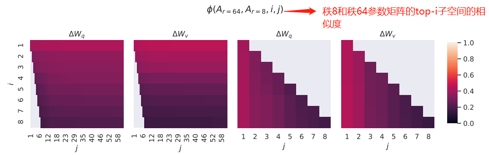
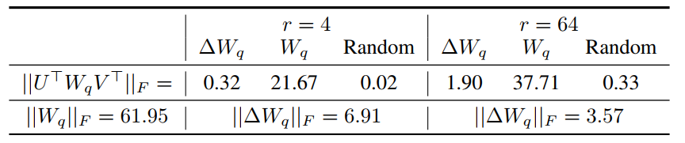

# LoRA微调
LoRA是一种用于微调大型语言模型的低秩适应技术，它最初应用于NLP领域，特别是用于微调GPT3等模型。LoRA通过仅训练低秩矩阵，然后将这些参数注入到原始模型中，从而实现对模型的微调。这种方法不仅减少了计算需求，而且使得训练资源比直接训练原始模型要小得多，因此非常适合在资源有限的环境下使用。
在Stable Diffusion模型的应用中，LoRA 被用作一种插件，允许用户在不修改Stable Diffusion模型的情况下，利用少量训练数据训练出具有特色画风、IP或人物特征的模型。
总体来说，LORA是一种高效、灵活且适用于多种场景的模型微调技术，它在保持原始模型性能的同时，允许用户根据需要进行定制化调整。

## 一、高效微调的基本原理

以语言模型为例，在微调过程中模型加载预训练参数$\Phi _0$进行初始化，并通过最大化条件语言模型概率进行参数更新$ \Phi_0+\Delta \Phi $，即：
$$ max_\Phi \sum_{(x,y)\in Z} \sum^{|y|}_{t=1}log(P_\Phi (y_t |x,y < t)) $$
这种微调方式主要的缺点是我们学习到的参数增量$\Delta \Phi$的维度和预训练参数$\Phi_0$是一致的，这种微调称为全量微调，使用的资源很多。研究者认为能用更少的参数表示上述要学习的参数增量$\Delta \Phi=\Delta \Phi(\Theta)$，其中$|\Theta|\ll|\Phi_{0}$，原先寻找$\Delta\Phi$的优化目标变为寻找$\Theta$：
$$
max_{\theta}\sum_{(x,y)\in Z} \sum_{t=1}^{|y|}\log(p_{\phi_{0}+\Delta\Phi(\Theta)}(y_{t}|x,y<t))
$$
这种仅微调一部分参数的方法称为高效微调。针对高效微调，研究者有很多的实现方式（如Adapter、prefixtuing等）。本文作者旨在使用一个低秩矩阵来编码$\Delta\Phi$，相比于其他方法，**LoRA不会增加推理耗时且更便于优化**。
## 二、LoRA的实现方式
我们可以先思考两个问题：为何用数千样本就能将一个数十亿参数的模型微调得比较好？为何大模型表现出很好的few-shot能力？
有学者的研究表明：**预训练模型拥有极小的内在维度（instrisic dimension），即存在一个极低维度的参数，微调它和在群参数空间中微调能起到相同的作用。同时还发现，在预训练之后，越大的模型有越小的内在维度，这也解释了为何大模型都拥有很好的few-shot能力**。

### LoRA


受Instrisic Dimension工作的启发，作者认为参数更新过程中也存在一个“内在秩”。对于预训练权重矩阵$W_{0}\in R^{d×k}$，我们可以用一个低秩分解来表示参数更新$\Delta W$，即：
$$
W_{0}+\Delta W=W_{0}+BA \qquad B\in R^{d×r},A\in R^{r×k} \quad and \quad r\ll min(d,k)
$$
LoRA的思想很简单：
- 在原始PLM（Pre-trained Language Model）旁边增加一个旁路，做一个降维再升维的操作，来模拟所谓的**instrisic dimension**。
- 训练过程中冻结参数$W_{0}$，仅训练A和B中的参数。如上图所示，对于$h=W_{0}x$，前向传播变为：
$$
h=W_{0}x+\Delta Wx=W_{0}x+BAx
$$
- 用随机高斯分布初始化A，用0矩阵初始化B，保证训练的开始此旁路矩阵仍然是0矩阵。
LoRA的这种思想有点类似于残差连接，同时使用这个旁路的更新来模拟Full Fine-Tuning的过程。并且，Full Fine-Tuning可以被看做是LoRA的特例。
在推理过程中，LoRA也几乎未引入额外的Inference Latency，只需计算$W=W_{0}+\Delta W$即可。LoRA与Transformer的结合也很简单，仅在QKV Attention的计算中增加一个旁路即可。

### LoRA为什么有效？

通过大量的对比实验，作者证明了LoRA的有效性，但是作者希望进一步解释这种下游任务中学到的低秩适应（low-rank adaptation）的特性。为此，作者提出了三个问题：

#### 1. LoRA应该作用于Transformer的哪个参数矩阵？


从上图我们可以看到：

- 将所有微调参数都放到Attention中的某一个参数矩阵的效果并不好，将可调参数平均分配到$W_{q}$、$W_{k}$和$W_{v}$的效果最好
- 即使是秩仅取4也能在$\Delta W$中获取足够的信息
因此在实际操作中，应当将可微调参数分配到多种类型权重矩阵中，而不应该用更大的秩单独微调某种类型的权重矩阵。

#### 2. LoRA最优的秩R是多少？


从上述实验结论我们可以看到，在秩小到1或者2的时候，LoRA仍然有不错的效果。因此作者假设：**更新参数矩阵矩阵$\Delta W$可能拥有极小的“内在秩”**。为求证此假设，作者需要计算不同秩对应的子空间之间的重叠程度，如下：
对于$r=8$和$r=64$两个秩，首先进行奇异值分解得到两个右奇异矩阵$U_{A_{r=8}}$和$U_{A_{r=54}}$。作者希望得到：$U_{A_{r=8}}$的$top_{i}$奇异向量有多少被包含在$U_{A_{r=64}}$的$top_{j}$个向量中。可用**格拉斯曼距离**来表示这种子空间之间的相似关系：
$$
\phi(A_{r=8},A_{r=64},i,j)=\frac{\Arrowvert  U^{iT}_{A_{r=8}}U^{j}_{A_{r=64}}\Arrowvert ^{2}_{F}}{min(i,j)}=\frac{\sum^{min(i,j)}_{k}\Lambda^{2}_{k}}{min(i,j)}
$$
从上图可以看出$r=8$和$r=64$中的奇异向量重叠最多（颜色越浅表示相似度越高)，也就是说top奇异向量的作用最大，其他的奇异向量可能会引入更多的噪声。这证明了**更新参数矩阵$\Delta W$存在极小的“内在秩”**。

#### 3. 参数增量$\Delta W$和$W$的关系？
为揭示微调过程中的内在原理，作者进行了如下实验：

从上图的对比结果来看，作者发现三个现象：

- 相比于随机矩阵，$\Delta W$和$W$有强关联。从表中的$0.32\gg0.02$可以看出。
- $\Delta W$仅放大了$W$中任务相关的特征，并未放大头部特征。我们知道F范数的平方等于奇异值和的平方，因此从表中的$0.32\ll 21.67$可以看出$\Delta W$和$W$的头部奇异向量并无关联。
- $r=4$时，$\Delta W$的放大系数已经很大了。计算$6.91/0.32 \approx 21.5$可知$\Delta W$能将$W$中相关的特征向量放大21.5倍。
因此我们可以得出结论：**在训练过程中，低秩的适应矩阵$\Delta W$仅仅放大了对下游任务有用的特征，而不是预训练模型中的主要特征**。
### LoRA实现
目前LoRA已经被HuggingFace集成在了[PEFT（Parameter-Efficient Fine-Tuning）](https://github.com/huggingface/peft)代码库中。使用也非常简单，比如我们使用LoRA微调BigScience机器翻译模型：
```python3
from transformers import AutoModelForSeq2SeqLM
from peft import get_peft_config, get_peft_model, LoraConfig, TaskType
model_name_or_path = "bigscience/mt0-large"
tokenizer_name_or_path = "bigscience/mt0-large"

peft_config = LoraConfig(
    task_type=TaskType.SEQ_2_SEQ_LM, inference_mode=False, r=8, lora_alpha=32, lora_dropout=0.1
)

model = AutoModelForSeq2SeqLM.from_pretrained(model_name_or_path)
model = get_peft_model(model, peft_config)
model.print_trainable_parameters()
# output: trainable params: 2359296 || all params: 1231940608 || trainable%: 0.19151053100118282
```
模型微调好之后，加载也非常简单，只需要额外加载LoRA参数：
```python3
model.load_state_dict(torch.load(peft_path),strict=False)
```

