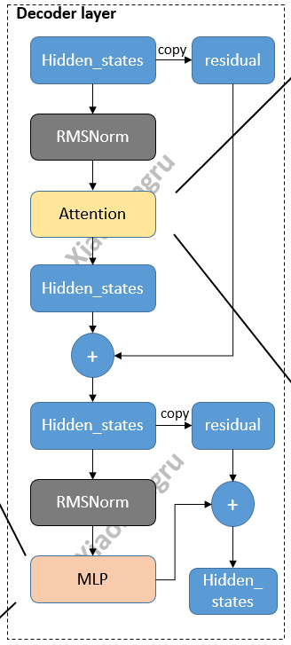
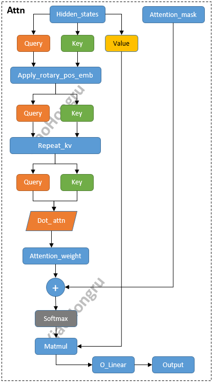
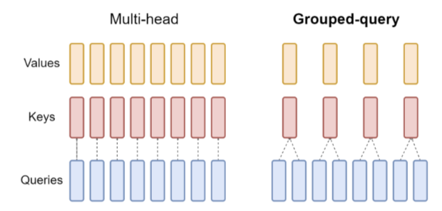

# Qwen


GPT这类模型都是由解码器为主要结构的模型，归根结底这类模型需要不断地自回归预测下一个 token，所以解码器是必不可少的一个结构。

上图即为Qwen2的主要结构，其中：

- `Tokenizer`是将文本转换为词表的工具，一般由一个预训练的model提供分词能力，例如Qwen2.5采用了BBPE提供分词
- `Embedding`是将分词转换为词向量
- `Attention_mask`是用来设定掩码遮蔽左边、右边或双向的
- 各类下游任务，`Casual`,`seqcls`等，基本都是基础模型`model`后面接对应的`Linear`层，还有损失函数不一样。

## 1. Qwen2Config

Qwen2Config中包含一些自定义的超参数，例如`vocab_size`,`hidden_size`,`num_hidden_layers`, `num_attention_heads`等。类似于`dict`可以调用里面的超参数:`config.pad_token_id`。

### 1.1 Qwen2Model

#### 1.1.1 初始化

- 设置了模型的两个属性：`padding_idx`（用于指定填充标记的索引），`vocab_size`（词汇表的大小）
- 初始化了模型的嵌入层、解码器层、归一化层
- 设置了是否使用`gradient_checkpoint`主要是用来节省显存
- 调用`post_init()`完成一些初始化和准备检查的工作

```python
class Qwen2Model(Qwen2PreTrainedModel):
    def __init__(slef,config: Qwen2Config):
        super().__init__(config)
        self.padding_idx = config.pad_token_id
        self.vocab_size = config.vocab_size
        
        self.embed_tokens = nn.Embedding(config.vocab_size, config.hidden_size, self.padding_idx)
        self.layers = nn.ModuleList([Qwen2DecoderLayer(config, layer_idx) for layer_idx in range(config.num_hidden_layers)])
        self.norm = Qwen2RMSNorm(config.hidden_size, eps=config.rms_norm_eps)
        
        self.gradient_checkpointing = False
        # Inintialize weights and apply final processing
        self.post_init()
```

其中`post_init()`主要是对参数初始化以及初始化梯度检查点：

```python
def post_init(self):
    self.init_weights()
    self._backward_compatibility_gradient_checkpointing()
```

#### 1.1.2 Forward

```python
inputs_embeds = self.embed_tokens(input_ids)
# embed positions
hidden_states = inputs_embeds

for idx, decoder_layer in enumerate(self.layers):
    # 将所有的hidden_states保存成tuple
    if output_hidden_states:
        all_hidden_states += (hidden_states,)
    # 将hs送入每一层decoder_layer
    layer_outputs = decoder_layer(
        hidden_states,
        attention_mask=attention_mask,
        position_ids=position_ids,
        past_key_value=past_key_value,
        output_attentions=output_attentions,
        use_cache=use_cache,
    )
    # 取出上一层decoder_输出的hs,再传入下一个layer
    # 只要第一个,第二个是cache的一个类，然后进入下一个layer
    hidden_states = layer_outputs[0]
    
# 将最后layers输出后的hidden_states进行标准化  
hidden_states = self.norm(hidden_states)
    
# 加上最后一层的hidden_states
if output_hidden_states:
    all_hidden_states += (hidden_states,)
```

这部分其实跟之前写过的代码没什么区别。最主要的还是要理解模型的结构。

### 1.2 Qwen2DecoderLayer



解码器的话，主要是三件套：`Attention`+`MLP`+`Norm`，可以看到这里与经典的Transformer的解码器是有一些差异的。比如，**`Norm`换成了`RMSNorm`；两个`Attention`换成了一个。**

```python
QWEN2_ATTENTION_CLASSES = {
    "eager": Qwen2Attention,  # 一般情况下是这个
    "flash_attention_2": Qwen2FlashAttention2,
    "sdpa": Qwen2SdpaAttention,
}

class Qwen2DecoderLayer(nn.Module):
    def __init__(self, config: Qwen2Config):
        super().__init__()
        self.hidden_size = config.hidden_size
        self.self_attn = QWEN2_ATTENTION_CLASSES[config._attn_implementation](config, layer_idx)

        self.mlp = Qwen2MLP(config)
        self.input_layernorm = Qwen2RMSNorm(config.hidden_size, eps=config.rms_norm_eps)
        self.post_attention_layernorm = Qwen2RMSNorm(config.hidden_size, eps=config.rms_norm_eps)
```

感觉这里边的细节应该是要去源码中去看看，应该会发现更多值得学习和考虑的东西。

### 1.3 Qwen2Attention



这部分的代码需要着重去看，核心的东西就在这块！

#### 1.3.1 初始化

核心的参数：

- `num_key_value_heads`：键值对的头数
- `num_key_value_groups`：键值对的组数
- `q_proj`,`k_proj`,`v_proj`,`o_proj`四个`Linear`操作。后续`LoRa`也基本都对他动的刀子

```python
class Qwen2Attention(nn.Module):
    """Multi-headed attention from 'Attention Is All You Need' paper"""

    def __init__(self, config: Qwen2Config):
        super().__init__()
        self.config = config
        self.layer_idx = layer_idx
        self.hidden_size = config.hidden_size
        self.num_heads = config.num_attention_heads
        self.head_dim = self.hidden_size // self.num_heads
        self.num_key_value_heads = config.num_key_value_heads
        self.num_key_value_groups = self.num_heads // self.num_key_value_heads
        self.max_position_embeddings = config.max_position_embeddings
        self.rope_theta = config.rope_theta
        self.is_causal = True
        self.attention_dropout = config.attention_dropout

        if (self.head_dim * self.num_heads) != self.hidden_size:
            raise ValueError(
                f"hidden_size must be divisible by num_heads (got `hidden_size`: {self.hidden_size}"
                f" and `num_heads`: {self.num_heads})."
            )
        self.q_proj = nn.Linear(self.hidden_size, self.num_heads * self.head_dim, bias=config.attention_bias)
        self.k_proj = nn.Linear(self.hidden_size, self.num_key_value_heads * self.head_dim, bias=config.attention_bias)
        self.v_proj = nn.Linear(self.hidden_size, self.num_key_value_heads * self.head_dim, bias=config.attention_bias)
        self.o_proj = nn.Linear(self.num_heads * self.head_dim, self.hidden_size, bias=config.attention_bias)
        
        self.rotary_emb = Qwen2RotaryEmbedding(
            self.head_dim,
            max_position_embeddings=self.max_position_embeddings,
            base=self.rope_theta,
        )
```

#### 1.3.2 Forward

这里边值得注意的东西，一个是**旋转位置编码**，它是一种扩展上下文长度的方法，另外还有很多其他的方法，比如**插值法**。另外一个就是`Repeat_KV`操作，因为`V`没有分头，所以需要增加`K`和`V`的尺寸，适配`V`的Size。

```python
# 获取形状信息,hidden_states输入的为(bs,T,hd)
bsz, q_len, _ = hidden_states.size()

# 对hidden_states进行Linear生成query、key、value
query_states = self.q_proj(hidden_states)
key_states = self.k_proj(hidden_states)
value_states = self.v_proj(hidden_states)

 # reshape多头处理--分块--(bs,T,heads,hd_d)
query_states = query_states.view(bsz, q_len, self.num_heads, self.head_dim).transpose(1, 2)
key_states = key_states.view(bsz, q_len, self.num_key_value_heads, self.head_dim).transpose(1, 2)
value_states = value_states.view(bsz, q_len, self.num_key_value_heads, self.head_dim).transpose(1, 2)

# 将旋转位置嵌入应用于查询和键张量。使用了旋转位置嵌入的余弦和正弦部分，将它们与查询和键张量相乘，并将结果相加，从而实现旋转位置嵌入的效果
cos, sin = self.rotary_emb(value_states, seq_len=kv_seq_len)
query_states, key_states = apply_rotary_pos_emb(query_states, key_states, cos, sin, position_ids)

# 先将key_states和value_states重复了num_key_value_groups次
key_states = repeat_kv(key_states, self.num_key_value_groups)
value_states = repeat_kv(value_states, self.num_key_value_groups)

# 使用dot attn实现q*kT/hd_d^0.5
attn_weights = torch.matmul(query_states, key_states.transpose(2, 3)) / math.sqrt(self.head_dim)

# 然后 attn_weights 加上 attention_mask，实现读取顺序
attn_weights = attn_weights + attention_mask

# softmax + dropout + values_states相乘
attn_weights = nn.functional.softmax(attn_weights, dim=-1, dtype=torch.float32).to(query_states.dtype)
attn_weights = nn.functional.dropout(attn_weights, p=self.attention_dropout, training=self.training)
attn_output = torch.matmul(attn_weights, value_states)

# 转置，修改形状等reshape操作
attn_output = attn_output.transpose(1, 2).contiguous()
attn_output = attn_output.reshape(bsz, q_len, self.hidden_size)

# 最后在进行一次o_proj
attn_output = self.o_proj(attn_output)

# 返回结果
return attn_output, attn_weights, past_key_value
```

#### 1.3.3 细节

这里有一些细节需要注意。

##### 1.3.3.1 GQA

首先，多头注意力机制在推理的时候，如果不做任何操作，其每次推理都会重复计算`K`和`V`的历史矩阵，这样是完全浪费计算资源的。所以，KV缓存机制会将历史的`K`和`V`缓存在显存中。

但是，随着上下文长度的不断增加，KV缓存占用的显存不断地在增加，于是研究者想出了一些办法：MQA和GQA。

MQA比较粗暴，他将KV缓存中的`K`和`V`多个头的值全部简化成一个相同的共享值，虽然提升了速度，但是对模型的性能有较大的影响。

既然一个不够，那么就有研究者提出了采用分组的形式，将多个头分组，在每个组内共享`K`和`V`的缓存。



其示例代码如下：

1. 定义初始张量

   ```python
   import torch
   
   # shape:(batch, seq_len, head, head_dim)
   q = torch.randn(10, 128, 8, 128)
   k = torch.randn(10, 128, 8, 128)
   v = torch.randn(10, 128, 8, 128)
   
   # 这里组数就是4了
   groups = q.shape[-2] // key.shape[-2]
   ```

2. 为了方便计算，扩展key，value

   ```python
   def repead_kv(hs:torch.Tensor, n_rep:int) -> torch.Tensor:
       batch, num_key_value_heads, head_dim = hs.shape
       if n_rep == 1:
           return hs
       hs = hs[:, :, None, :, :].expand(batch, num_key_value_heads, n_rep, slen, head_dim)
       # reshape make head -> head * group
       return hidden_states.reshape(batch, num_key_value_heads * n_rep, slen, head_dim)
   ```

3. 矩阵乘法得到score与output 后面就是征程的kqv相乘了

   ```python
   #(bs, head, seq_len, head_dim)
   q = q.transpose(1, 2)
   k = repeat_kv(k.transpose(1, 2), 4)
   v = repeat_kv(v.transpose(1, 2), 4)
   scores = torch.matmul(q, k.transpose(2, 3)) / math.sqrt(head_dim)
   scores = torch.nn.functional.softmax(scores, dim=-1)
   
   out = torch.matmul(scores, v)
   #上一步转置了，还得转回去
   out = out.transpose(1, 2)
   ```

   **为什么要用expand之后再reshape而不能直接用tensor自带的repeat? **

   - `expand`方法用于对张量进行扩展，但不实际分配新的内存。它返回的张量与原始张量共享相同的数据 
   - `repeat`方法通过实际复制数据来扩展张量。它返回的新张量不与原始张量共享数据，扩展后的张量占用了更多的内存。

##### 1.3.3.2 RoPE

之所以引入位置编码，本质是`Attention`本身无法很好的理解位置信息，交换`token`的位置之后，`Attention`中对应的权重不会有数值的变化。因此需要引入位置信息来保证时序信息的理解能力。

在经典的`Transformer`结构当中，位置信息通过绝对位置编码的方式（即正余弦函数）编码，其公式如下：

$$PE_{(pos,2i)}=\sin\left(\frac{pos}{10000^{2i/d_{\mathrm{model}}}}\right)$$

$$PE_{(pos,2i+1)}=\cos\left(\frac{pos}{10000^{2i/d_{\mathrm{model}}}}\right)$$

其中`pos`是token的位置，`i`是维度索引。其对每个token的每个维度都进行了位置编码。简单总结下：

- 因为正弦和余弦函数都是周期函数，编码在不同维度上具有不同的周期性
- 位置编码向量是唯一的，因为不同位置的编码由不同的正弦和余弦值组成
- 低维度的编码值波动性很大（周期短，捕捉局部位置信息），高纬度的编码值波动性较小（周期长，捕捉全局位置信息）

那么为什么要采用其他编码方式呢？首先，**绝对位置编码是不可学习的，其次绝对位置编码外推能力不足。**


