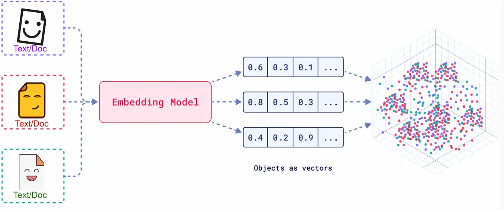

# 向量嵌入

## 基础知识

向量嵌入（Embedding）是一种将真实世界中复杂、高维的数据对象（如文本、图像、音频、视频等）转化为数学上易于处理的、低维、稠密的连续数值向量的技术。

将每个词、每段话、每一张照片都放在一个巨大的多维空间里，并给它一个独一无二的坐标。这个坐标就是一个向量，它“嵌入”了原始数据的所有关键信息。这个过程就是Embedding。

Embedding产生的向量不是随机数值的堆砌，而是对数据**语义**的数学编码。

- 核心原则：在Embedding构建的向量空间中，语义上相似的对象，其对应的向量在空间中的距离更近；而语义上不相关的对象，它们的向量距离更远。

RAG中的检索环节通常以基于Embedding的语义搜索为核心。通用流程如下：

1. **离线索引构建**：将知识库内文档切分后，使用Embedding模型将每个文档块（chunk）转换为向量，存入专门的向量数据库中。
2. **在线查询检索**：当用户提出问题时，使用相同的Embedding模型生成Query的向量。
3. **相似度计算**：在向量数据库中，计算Query向量与所有文档块向量的相似度。
4. **召回上下文**：选取相似度最高的Top-K个文档块，作为补充的上下文信息，与原始问题一同送入大模型生成最终的答案。

Embedding的质量直接决定了RAG检索召回内容的准确性与相关性。一个优秀的Embedding模型能够精准捕捉问题和文档之间的深层语义联系。反之，一个劣质的Embedding模型可能会因为无法理解语义而召回不相关的错误信息，导致最终生成的答案质量低下。

## Embedding技术发展

### 1. 静态词嵌入：上下文无关的表示

- 代表模型：Word2Vec(2013), GloVe(2014)
- 主要原理：为词汇表中每个单词生成一个固定的、与上下文无关的向量。例如，`Word2Vec`通过Skip-gram和CBOW架构，利用局部上下文窗口学习词向量，并验证了向量运算的语义能力（如`国王 - 男人 + 女人 ≈ 王后`。`GloVe`则融合了全局词-词共现矩阵的统计信息。
- 局限性：无法处理一词多义问题。

### 2. 动态上下文嵌入

2017年，Transformer架构的诞生带来的自注意力机制。它允许模型在生成一个词的向量时，动态的考虑句子中所有其他词的影响。基于此，2018年BERT模型利用Transformer的编码器，通过掩码语言模型（MLM）等自监督任务进行预训练，生成了深度上下文相关的嵌入。同一个词在不同的语境下会生成不同的向量。

### 3. RAG对嵌入技术的新要求

2020年，RAG框架的提出，旨在解决大模型知识固化和幻觉的问题。RAG通过“检索-生成”范式，动态地为LLM注入外部知识。这一过程的核心是**语义检索**，它完全依赖于高质量的向量嵌入。

RAG的兴起对嵌入技术提出了更高、更具体的要求：

- **领域自适应能力**：通用的嵌入模型在专业领域（如法律、医疗）可能表现不佳。因此，能够通过微调或使用指令来适应特定领域术语和语义的嵌入模型变得至关重要。
- **多粒度与多模态支持**：RAG系统需要处理的不仅仅是短句，还可能包括长文档、代码，甚至是图像和表格。这就要求嵌入模型能够处理不同长度和类型的输入数据。
- **检索效率与混合检索**：嵌入向量的维度和模型大小直接影响存储成本和检索速度。同时，为了结合语义相似性（稠密检索）和关键字匹配（稀疏检索）的优点，支持混合检索的嵌入模型（如BGE-M3）应运而生，在某些任务中成为了提升召回率的关键。

## 嵌入模型训练原理

### 1. 核心架构：BERT

现代嵌入模型的核心通常是Transformer的编码器（Encoder）部分，BERT就是其中的典型代表。它通过堆叠多个Transformer Encoder层来构建一个深度的双向表示学习网络。

### 2. 核心训练任务

BERT的成功很大程度上归功于其巧妙的**自监督学习**策略，它允许模型从海量的、无标注的文本数据中学习知识。

​		