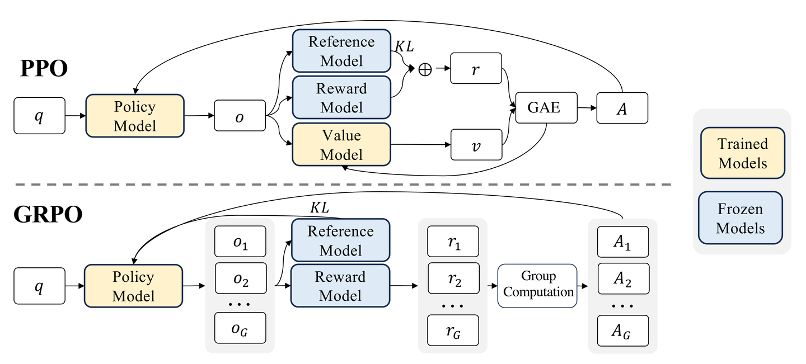

# 组相对策略优化（GRPO）

在对大模型进行微调的环节中，强化学习具有不可替代的重要作用。当前，广泛应用的近端策略优化算法（PPO）在应用大规模模型时，遭遇了沉重的计算和存储压力。鉴于PPO算法需要构建一个与策略模型规模大体相当的价值网络来对优势函数进行评估，这便引发了显著的内存（显存）成本和计算成本。

而且PPO算法在更新策略的过程中，极有可能导致策略分布产生剧烈波动，进而波及训练的稳定性。鉴于上述种种问题，DeepSeek提出了一种创新的强化学习算法——组相对策略优化算法（GRPO）。其目标在于降低对价值网络的依赖程度，与此同时确保策略更新的稳定性与高效性。

