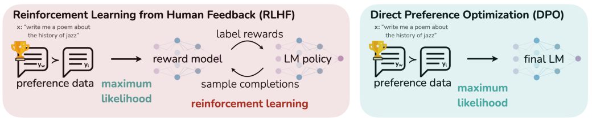
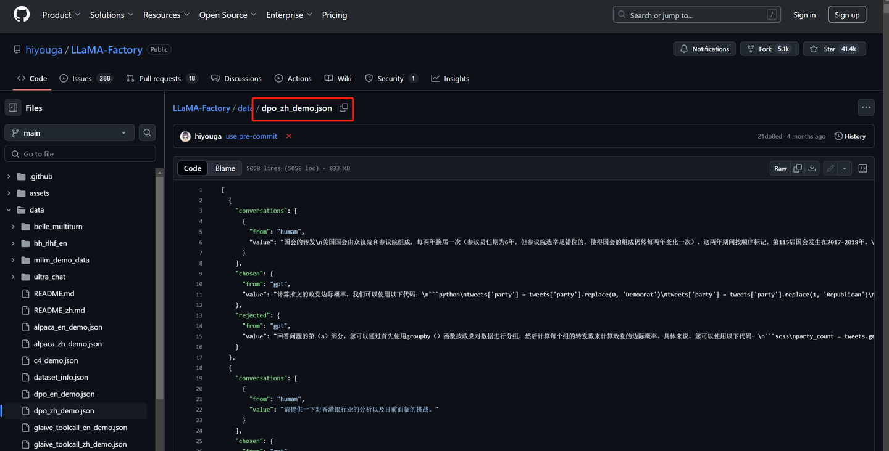

# 直接偏好优化（DPO）

虽然大规模无监督语言模型（LLMs）能够学习广泛的世界知识和一定的推理能力，但是由于其训练过程完全无监督，要实现对其行为的精确控制是非常困难的。现有的方法通过收集模型生成的相对质量的人类标注，微调LLM以符合这些偏好，通常采用从人类反馈中进行强化学习（RLHF）。然而，RLHF是一种复杂且通常不稳定的过程，首先需要拟合反馈人类偏好的奖励模型，然后使用强化学习来微调LLM以最大化这一估计的奖励，同时避免与原始模型偏离过远。直接偏好优化（DPO）算法是一种新的强化学习方法，它仅需通过一个**简单的分类损失**来解决标准的RLHF方法的问题。**其具有稳定、高效且计算负担轻的特点**，无需在微调过程种从LLM采样或进行大量超参数调整。它通过一个简单的二元交叉熵目标来精确优化，从而极大的简化了偏好学习流程。

DPO可以直接依据策略来定义偏好损失。当存在一个关于模型响应的人类偏好数据集时，DPO能够在训练过程中，使用简单的二元交叉熵目标来对策略进行优化，而无需明确地区学习奖励函数或者从策略中进行采样。DPO只需要加载2个模型，其中一个推理，另外一个训练，直接在偏好数据上进行训练即可。

$$\mathcal{L}_{\mathrm{DPO}}(\pi_{\theta};\pi_{\mathrm{ref}})=-\mathbb{E}_{(x,y_{w},y_{l})\sim\mathcal{D}}\left[\log\sigma\left(\beta\log\frac{\pi_{\theta}(y_{w}\mid x)}{\pi_{\mathrm{ref}}(y_{w}\mid x)}-\beta\log\frac{\pi_{\theta}(y_{l}\mid x)}{\pi_{\mathrm{ref}}(y_{l}\mid x)}\right)\right]$$

相关符号的解释：

- $\sigma$：sigmoid函数

- $\beta$：超参数，一般在0.1-0.5之间
- $y_w$：某条偏好数据中好的response，$w$是win的意思
- $y_l$：某条偏好数据中差的response，$l$是loss的意思，所以偏好数据也叫comparison data
- $\pi_{\theta}(y_{w}|x)$：给定输入x，当前policy model生成好的response的累积概率（每个token的对数概率求和）
- $\pi_{ref}(y_{l}|x)$：给定输入x，原始模型（reference model）生成坏的response的累积概率

训练时，reference model和policy model都是同一个模型，只不过在训练过程中reference model不会更新权重。

该目标增加了对偏好数据$y_w$的可能性，并减少非偏好数据$y_l$的可能性。

$$\hat{r}_\theta(x,y)=\beta\log\frac{\pi_\theta(y|x)}{\pi_\mathrm{ref}(y|x)}$$

这个公式其实有点像变种的奖励函数，通过$\beta$参数的权重来调节，$\pi_{\theta}$参数的优化等效与在此变量更改下的奖励模型优化。

DPO算法的优化目标非常简单，利用了从奖励函数到最优策略的解析映射，允许直接使用人类偏好数据进行简化的优化过程。

DPO的数据集主要由三部分组成：`instruct prompt`、`chosen`、`rejected`。

从数据集中可以明显的看出，其实就是想让模型拟合我们期望的chosen数据，不要回答rejected类型的数据。这种思想很像对比学习，拉开正负样本差距，让模型学习指定输出正确的回答。

DPO算法的核心优势：

1. 训练效率显著提升

- 省去奖励模型训练：DPO绕过了RLHF中独立的奖励模型训练阶段，直接利用偏好数据调整模型策略，减少了计算成本和训练时间。
- 单阶段优化：将问题转化为分类任务（最大化偏好数据似然），无需交替优化策略和奖励模型，简化了实现流程。

2. 算法稳定性更强

- 规避强化学习的高方差问题：传统RLHF依赖策略梯度方法（如PPO），容易因奖励稀疏或噪声导致训练不稳定，而DPO通过概率匹配直接优化策略，降低方差。
- 数据理论保障：DPO基于偏好模型的严格数据推导，确保在理想数据下收敛到最优策略。

3. 实现复杂度低

- 无需复杂调参：RLHF需平衡策略更新幅度、奖励模型置信度等超参数，DPO仅需调整学习率和偏好权重。

4. 数据利用更高效

- 直接偏好建模：通过对比正/负样本对的偏好概率，更精确地捕捉人类的意图，避免奖励模型因“过度简化”偏好关系导致的偏差。

DPO算法的局限性

1. 对数据质量高度敏感

- 依赖高质量偏好数据：若数据存在噪声或覆盖不全，模型易过拟合错误偏好。而RLHF可通过奖励模型泛化部分噪声，但DPO直接依赖原始数据。
- 需大规模标注数据：DPO的性能与偏好数据量强相关，标注成本可能成为瓶颈。

2. 灵活性受限

- 静态偏好：DPO假设偏好关系固定，**难以动态适应复杂或分层的偏好**。
- 难以引入先验知识：RLHF允许手动调整奖励函数（如添加安全约束），而DPO完全由数据驱动，缺乏显式干预手段。

3. 可解释性较弱

- 黑箱优化过程：DPO直接调整策略参数，缺乏RLHF中奖励模型的中间信号，难分析模型决策依据，不利于调试。

