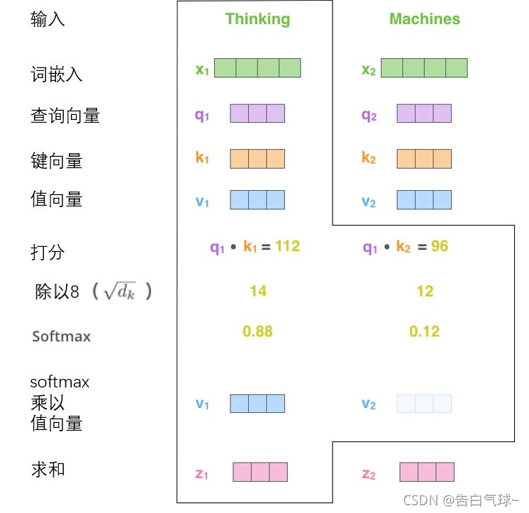

# Transformer

Transformer模型由编码器和解码器两部分组成，每部分都由多层堆叠的相同结构构成。

## 编码器

编码器由N层相同的模块堆叠而成，每层包含两个子层：

- 多头自注意力机制（Multi-Head Self-Attention）：计算输入序列中每个词与其他词的相关性。
- 前馈神经网络（Feed-Forward Neural Network)：对每个词进行独立的非线性变换。

每个子层后面都有残差连接（Residual Connection）和层归一化（Layer Normalization）。

## 解码器

解码器也由N层相同的模块堆叠而成，每层包含三个子层：

- 掩码多头自注意力机制（Masked Mutil-Head Self-Attention）：计算输出序列中每个词与前面词的相关性。
- 编码器-解码器多头交叉注意力机制（Encoder-Decoder Attention）：计算输出序列与输入序列的相关性。
- 前馈神经网络（Feed-Forward Neural Network）：对每个词进行独立的非线性变换。

同样，每个子层后面都有残差连接和层归一化。

## Transformer核心思想

### 1. 自注意机制（Self-Attention）

自注意力机制是Transformer的核心组件。它允许模型在处理序列时，动态地为每个位置分配不同的权重，从而捕捉序列中任意两个位置之间的依赖关系。

$$\operatorname{Attention}(Q, K, V)=\operatorname{softmax}\left(\frac{Q K^T}{\sqrt{d_k}}\right) V$$

其中：Q是查询矩阵，K是键矩阵，V是值矩阵，$d_k$是向量的维度，用于缩放点积，防止梯度爆炸。

#### 多头注意力（Multi-Head Attention）

为了捕捉更丰富的特征，Transformer使用多头注意力机制。它将输入分成多个子空间，每个子空间独立计算注意力，最后将结果拼接起来。

- 多头注意力的优势：允许模型关注序列中不同的部分，例如语法结构、语义关系等。
- 并行计算：多个注意力头可以并行计算。

#### 位置编码（Positional Encoding）

由于Transformer没有显式的序列信息，位置编码被用来输入序列中每个词添加位置信息。通常使用正弦和余弦函数生成位置编码：

$$PE_{(pos,2i)}=\sin\left(\frac{pos}{10000^{2i/d_{\mathrm{model}}}}\right)$$

$$PE_{(pos,2i+1)}=\cos\left(\frac{pos}{10000^{2i/d_{\mathrm{model}}}}\right)$$

其中，`pos`是词的位置，`i`是维度索引。

#### 编码器-解码器架构

`Transformer`模型由编码器和解码器两部分组成：

- 编码器：将输入序列转换为一系列隐藏表示。每个编码器层包含一个自注意力机制和一个前馈神经网络。
- 解码器：根据编码器的输出生成目标序列。每个解码器层包含两个注意力机制（掩码注意力机制和与编码器相连的多头交叉注意力机制）和一个前馈神经网络。

#### 前馈神经网络（Feed-Forward Neutral Network）

每个编码器和解码器层都包含一个前馈神经网络，通常由两个全连接层组成，中间使用ReLU激活函数。

#### 残差连接和层归一化

为了稳定训练过程，每个子层（如自注意力层和前馈神经网络）后面都会接入一个残差连接和层归一化。

### 图示

其实就是通过一个大的矩阵点积运算来计算不同token之间的差异，模型就会记住这种差异，这些差异就是模型的权重。**其实有关于相似性的方法基本上都是基于矩阵点积运算的原理。**

