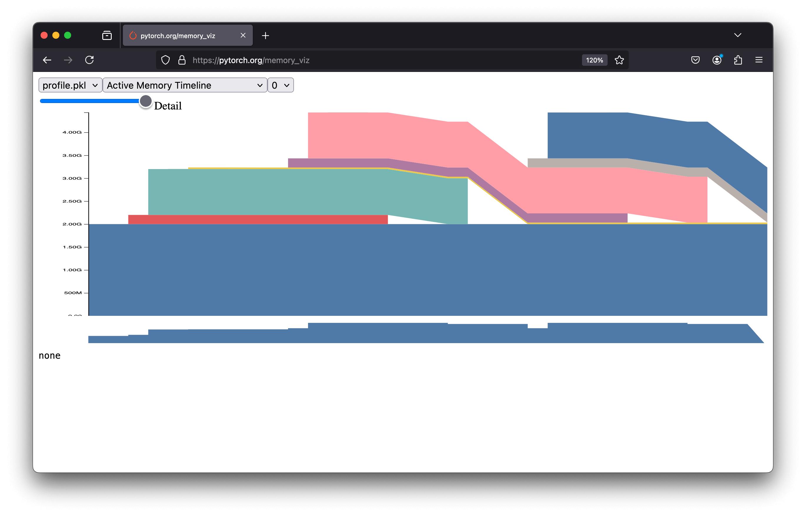
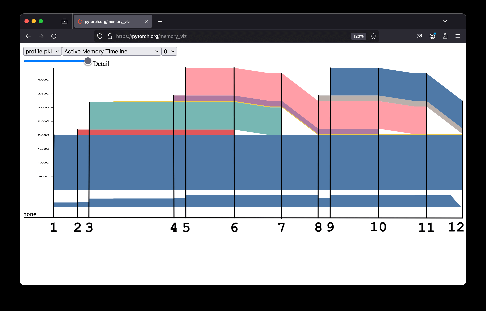
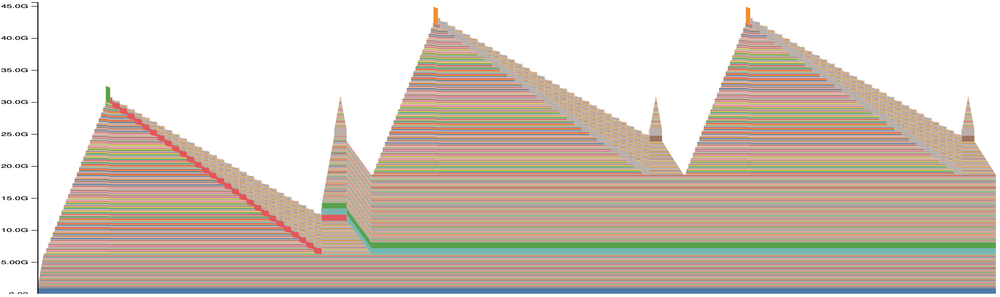
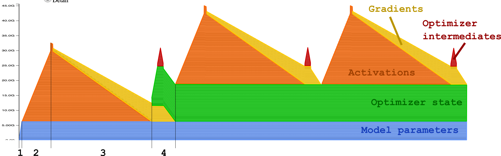
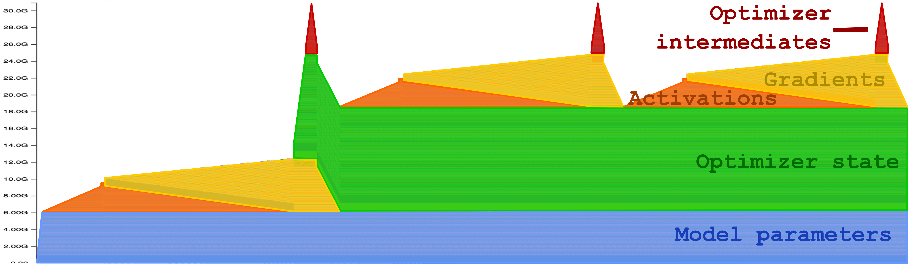

# Visualize and understand GPU memory in PyTorch

## The PyTorch visualizer

```python
import torch
from torch import nn

# Start recording memory snapshot history
torch.cuda.memory._record_memory_history(max_entries=100000)

model = nn.Linear(10000,50000,device='cuda')

for _ in range(3):
inputs = torch.randn(5000,10000,device='cuda')
outputs = model(inputs)

# Dump memory snapshot history to a file and stop recording
torch.cuda.memory._dump_snapshot('profile.pkl')
torch.cuda.memory._record_memAory_history(enabled=None)
```

Running this code generates a `profile.pkl` file that contains a history of GPU memory usage during execution. You can visualize this history at: [https://pytorch.org/memory_viz](https://pytorch.org/memory_viz).

By dragging and dropping your `profile.pkl` file, you will see a graph like this:


 Let's break down this graph into key parts:
   

1. **Model Creation**: Memory increases by 2 GB, corresponding to the model's size:

   $10000 × 50000\; weights + 5000\; biases\; in\; float32\; (4\; bytes) = (5 × 10^8) × 4\; bytes = 2\; GB$

   This memory ==(in blue)== persists throughout execution.

2. **Input Tensor Creation (1st Loop)**: Memory increases by 200 MB matching the input tensor size:

   $5000\; \times 1000\; elements\; in\; float32\; (4\; bytes) = (5 \times 10^{7}) \times 4\; bytes = 0.2 GB$

3. **Forward Pass (1st Loop)**: Memory increases by 1GB for the output tensor:

   $5000\; \times 50000\; elements\; in\; float32\; (4\; bytes) = (25 \times 10^{7}) \times 4\; bytes = 1 GB$

4. **Input Tensor Creation (2nd Loop)**: Memory increases by 200 MB for a new input tensor. At this point, you might expect the input tensor from step 2 to be freed. Still, it isn’t: ==the model retains its activation, so even if the tensor is no longer assigned to the variable `inputs`, it remains referenced by the model’s forward pass computation.== The model retains its activations because these tensors are required for the backpropagation process in neural networks. Try with `torch.no_grad()` or `torch.inference_mode()` to see the difference.
5. **Forward Pass (2nd Loop)**: Memory increases by 1 GB for the new output tensor, calculated as in step 3.
6. **Release 1st Loop Activation**: After the second loop’s forward pass, the input tensor from the first loop (step 2) can be freed. The model’s activations, which hold the first input tensor, are overwritten by the second loop’s input. Once the second loop completes, the first tensor is no longer referenced and its memory can be released.
7. **Update `output`**: The output tensor from step 3 is reassigned to the variable `output`. The previous tensor is no longer referenced and is deleted, freeing its memory.
8. **Input Tensor Creation (3rd Loop)**: Same as step 4.
9. **Forward Pass (3rd Loop)**: Same as step 5.
10. **Release 2nd Loop Activation**: The input tensor from step 4 is freed.
11. **Update `output` Again**: The output tensor from step 5 is reassigned to the variable `output`, freeing the previous tensor.
12. **End of Code Execution**: All memory is released.


## Visualizing Memory During Training

The previous example was simplified. In real scenarios, we often train complex models rather than a single linear layer. Additionally, the earlier example did not include the training process. Here, we will examine how GPU memory behaves during a complete training loop for a real large language model.

```python
import torch
from transformers import AutoModelForCausalLM

# Start recording memory snapshot history
torch.cuda.memory._record_memory_history(max_entries=100000)

model = AutoModelForCausalLM.from_pretrained("Qwen/Qwen2.5-1.5B").to("cuda")
optimizer = torch.optim.AdamW(model.parameters(), lr=1e-3)

for _ in range(3):
    inputs = torch.randint(0, 100, (16, 256), device="cuda")  # Dummy input
    loss = torch.mean(model(inputs).logits)  # Dummy loss
    loss.backward()
    optimizer.step()
    optimizer.zero_grad()

# Dump memory snapshot history to a file and stop recording
torch.cuda.memory._dump_snapshot("profile.pkl")
torch.cuda.memory._record_memory_history(enabled=None)
```

**💡Tip:** When profiling, limit the number of steps. Every GPU memory event is recorded, and the file can become very large. For example, the above code generates an 8 MB file.

Here’s the memory profile for this example:



This graph is more complex than the previous example, but we still break it down step by step. Notice the three spikes, each corresponding to an iteration of the training loop. Let’s simplify the graph to make it easier to interpret:



1. **Model Initialization**: The first step involves loading the model onto the GPU. The model parameters (==in blue==) occupy memory and remain there until the training ends.
2. **Forward Pass**: During the forward pass, the activations (intermediate outputs of each layer) are computed and stored in memory for backpropagation. These acitivations, represented ==in orange==, grow layer by layer until the final layer. The loss is calculated at the peak of the orange zone.
3. **Backward Pass**: The gradients (==in yellow==) are computed and stored during this phase. Simultaneously, the activations are discarded as they are no longer needed, causing the orange zone to shrink. The yellow zone represents memory usage for gradient calculations.
4. **Optimizer Step**: Gradients are used to update the model’s parameters. Initially, the optimizer itself is initialized (green zone). This initialization is only done once. After that, the optimizer uses the gradients to update the model’s parameters. To update the parameters, the potimizer temporarily stores intermediate values (==red zone==). After the update, both the gradients (yellow) and the intermediate optimizer values (red) are discarded, freeing memory.

At this point, one training iteration is complete. The process repeats for the remaining iterations, producing the three memory spikes visible in the graph.

Training profiles like this typically follow a consistent pattern, which makes them useful for estimating GPU memory requirements for a given model and training loop.

## Estimating Memory Requirements

From the above section, estimating GPU memory requirements seems simple. The total memory needed should correspond to the highest peak in the memory profile, which occurs during the **forward pass**. In that case, the memory requirement is (==blue + green + orange==): **Model Parameters + Optimizer State +Activations**

Is it that simple? Actually, there is a trap. The profile can look different depending on the training setup. For example, reducing the batch size from 16 to 2 changes the picture:



Now, the highest peaks occur during the **optimizer step** rather than the forward pass. In this case, the memory requirement becomes (==blue + green + yellow +red==): **Model Parameters + Optimizer State + Gradients + Optimizer Intermediates**

To generalize the memory estimation, we need to account for all possible peaks, regardless of whether they occur during the forward pass or optimizer step. **Model Parameters + Optimizer State+max(Gradients+Optimizer Intermediates,Activations)**

Now that we have the equation, let’s see how to estimate each component.
