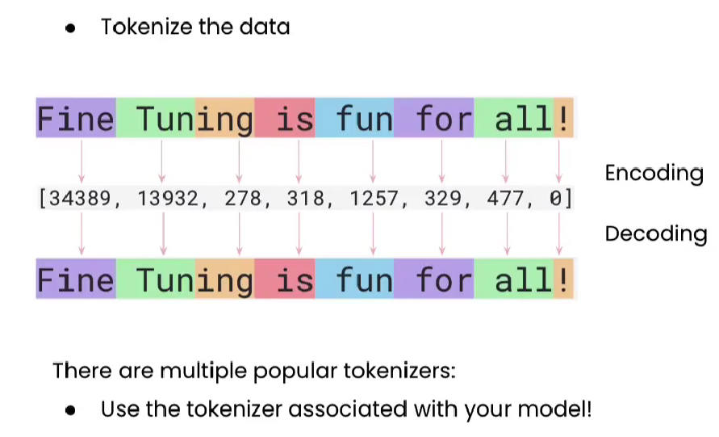
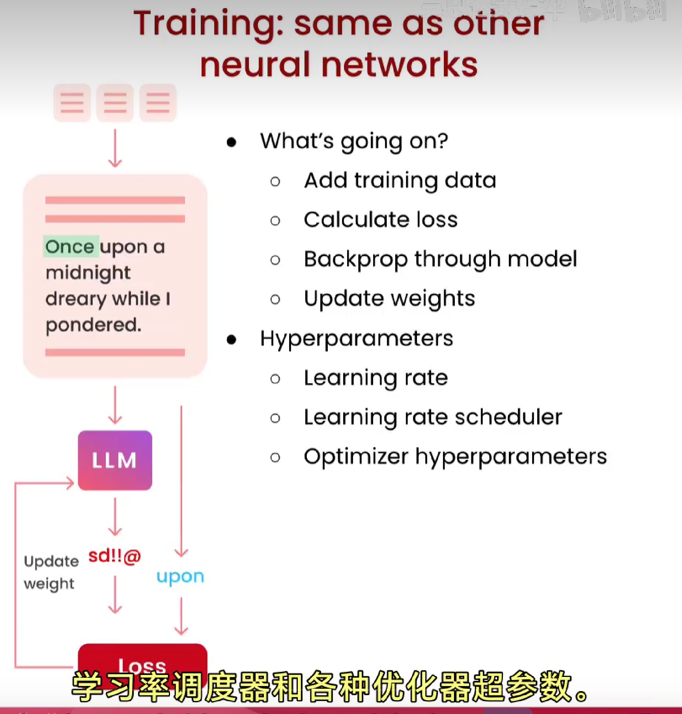
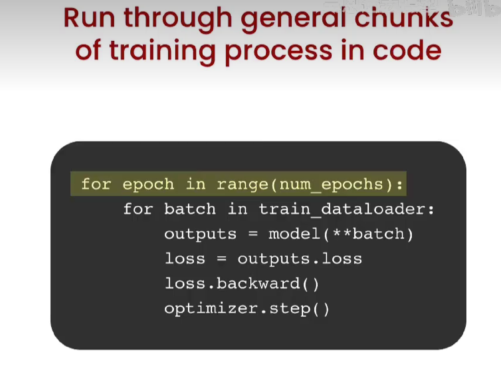

# 指令微调（Instruction Finetuning）
 指令微调是一种教模型如何遵循人类指令输出结果的微调方式，它的基本原理是在已有模型的基础上，使用一组精心设计的指令（prompt）和对应的期望输出来更新模型的参数。这些指令可以是对某个问题的回答、文章的总结、代码的生成等任务的具体表述。目标是让模型学会如何根据这些指令生成正确的答案或者执行指定的任务。

## Data Prep、Training、Evaluation
## 一、数据准备（Data Preparation）

### 什么样的数据才是需要的

1. 高质量：大模型会学习预训练输入的数据，如果训练数据的质量不高，训练得到的模型效果也不会好。
2. 多样性：如果你的数据覆盖各种使用场景，这会有助于模型的训练。如果训练数据都很类似，模型就只会反复输出相同的内容。
3. 真实性：使用真实的数据往往比虚假的数据更加有效，尤其是在一些写作这样的任务中，有些模型使用chatGPT生成的数据进行训练，这样训练好的模型往往带有chatGPT输出格式的印记（模式）。
4. 数据量大：在机器学习当中，数据的数量一般是越多越好。在大模型领域也是这样的，但是大模型在预训练之时已经从巨量的数据中学到了足够的知识，所以微调之时并不需要和预训练之时的数据规模，一般在几千到几万条较为合适。
### 如何准备我的数据

1. 收集**指令** ——**回答** 配对数据，如果需要的话给数据添加提示词模板
2. 对数据进行**向量化（tokenization）**，对数据进行填充或者截断

3. 将数据集分为**训练集**和**测试集** 
## 二、训练过程（Training Process）
### 训练步骤
1. 给模型喂入数据
2. 计算loss
3. 反向传播
4. 更新权重
### 超参数
学习率、学习率调度器、优化器超参数

## 三、模型评估（Evaluation）
